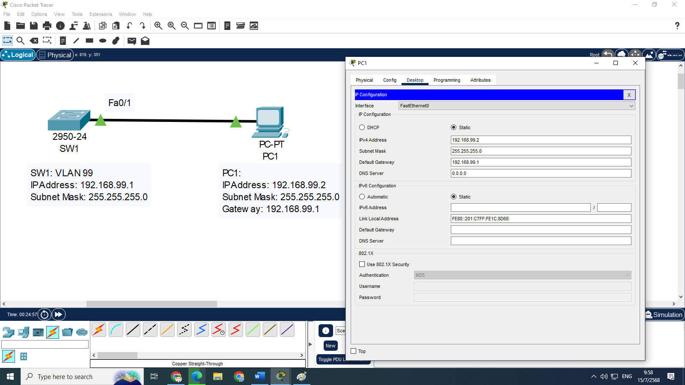
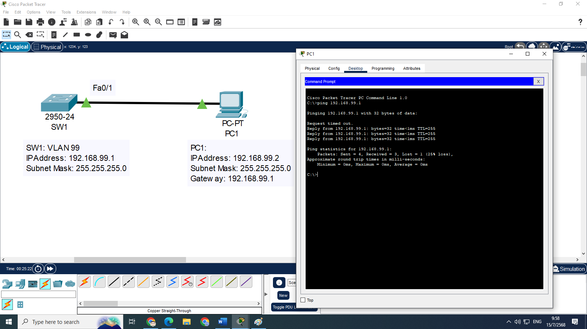
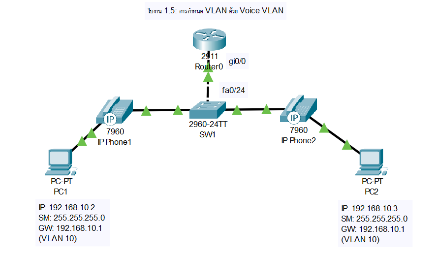
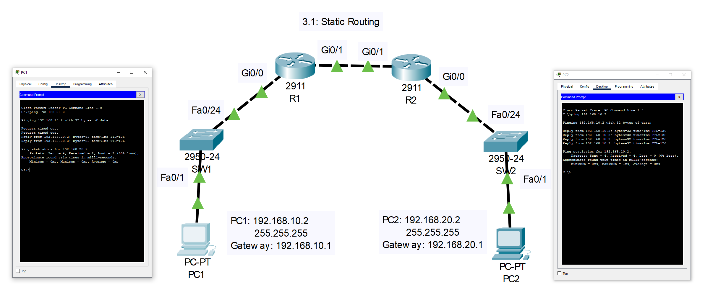

# ใบงานการตั้งค่าเครือข่ายใน Cisco Packet Tracer (v.8.2.2)

เอกสารนี้ประกอบด้วยใบงานปฏิบัติการเครือข่ายสำหรับหัวข้อ VLAN, Inter-VLAN, IP Routing, DHCP, DHCP Snooping, Loop Guard, Spanning Tree, Link Aggregation, NAT และ Access Control List (ACL) โดยใช้ Cisco Packet Tracer v.8.2.2 ระดับความยากปานกลางถึงยาก

---

## 1. VLAN (มีจำนวน 5 ใบงาน)

### ใบงาน 1.1: การสร้างและกำหนด VLAN พื้นฐาน
**วัตถุประสงค์**: สร้าง VLAN 2 ตัวและกำหนดพอร์ตให้ PC ใน VLAN ที่แตกต่างกัน  
**อุปกรณ์ที่ใช้**:
- Switch: Cisco 2960-24TT (1 ตัว, SW1)
- PC: 4 เครื่อง (PC1, PC2, PC3, PC4)

**การเชื่อมต่อสาย**:
- PC1 --(Straight-through)--> SW1 (Fa0/1)
- PC2 --(Straight-through)--> SW1 (Fa0/2)
- PC3 --(Straight-through)--> SW1 (Fa0/3)
- PC4 --(Straight-through)--> SW1 (Fa0/4)

**การกำหนด IP Address, Subnet, Gateway**:
- PC1: 192.168.10.2/24, Gateway: 192.168.10.1 (VLAN 10)
- PC2: 192.168.10.3/24, Gateway: 192.168.10.1 (VLAN 10)
- PC3: 192.168.20.2/24, Gateway: 192.168.20.1 (VLAN 20)
- PC4: 192.168.20.3/24, Gateway: 192.168.20.1 (VLAN 20)

**การกำหนดชื่อและการตั้งค่า**:
```plaintext
Switch>enable
Switch#configure terminal
Switch(config)#hostname SW1
SW1(config)#vlan 10
SW1(config-vlan)#name SALES
SW1(config-vlan)#exit
SW1(config)#vlan 20
SW1(config-vlan)#name ENGINEERING
SW1(config-vlan)#exit
SW1(config)#interface fa0/1
SW1(config-if)#switchport mode access
SW1(config-if)#switchport access vlan 10
SW1(config-if)#exit
SW1(config)#interface fa0/2
SW1(config-if)#switchport mode access
SW1(config-if)#switchport access vlan 10
SW1(config-if)#exit
SW1(config)#interface fa0/3
SW1(config-if)#switchport mode access
SW1(config-if)#switchport access vlan 20
SW1(config-if)#exit
SW1(config)#interface fa0/4
SW1(config-if)#switchport mode access
SW1(config-if)#switchport access vlan 20
SW1(config-if)#exit
SW1(config)#exit
SW1#wr
```

**การทดสอบการทำงาน**:
- ใช้คำสั่ง `show vlan brief` เพื่อยืนยันว่า VLAN 10 และ 20 มีพอร์ตที่กำหนดถูกต้อง
- จาก PC1 ping PC2 (ควรสำเร็จ) และ ping PC3 (ควรล้มเหลว)
- จาก PC3 ping PC4 (ควรสำเร็จ) และ ping PC1 (ควรล้มเหลว)

**ภาพการเชื่อมต่อ (Text)**:
```
[PC1 (VLAN 10)] -- [SW1 (Fa0/1)]
[PC2 (VLAN 10)] -- [SW1 (Fa0/2)]
[PC3 (VLAN 20)] -- [SW1 (Fa0/3)]
[PC4 (VLAN 20)] -- [SW1 (Fa0/4)]
```

---

### ใบงาน 1.2: การจัดการ VLAN ด้วย Trunk Link
**วัตถุประสงค์**: ตั้งค่า VLAN และ Trunk Link ระหว่างสวิตช์ 2 ตัว  
**อุปกรณ์ที่ใช้**:
- Switch: Cisco 2960-24TT (2 ตัว, SW1, SW2)
- PC: 4 เครื่อง (PC1, PC2, PC3, PC4)

**การเชื่อมต่อสาย**:
- PC1 --(Straight-through)--> SW1 (Fa0/1)
- PC2 --(Straight-through)--> SW1 (Fa0/2)
- PC3 --(Straight-through)--> SW2 (Fa0/1)
- PC4 --(Straight-through)--> SW2 (Fa0/2)
- SW1 (Fa0/24) --(Cross-over)--> SW2 (Fa0/24)

**การกำหนด IP Address, Subnet, Gateway**:
- PC1: 192.168.10.2/24, Gateway: 192.168.10.1 (VLAN 10)
- PC2: 192.168.10.3/24, Gateway: 192.168.10.1 (VLAN 10)
- PC3: 192.168.20.2/24, Gateway: 192.168.20.1 (VLAN 20)
- PC4: 192.168.20.3/24, Gateway: 192.168.20.1 (VLAN 20)

**การกำหนดชื่อและการตั้งค่า**:
- **SW1**:
```plaintext
Switch>enable
Switch#configure terminal
Switch(config)#hostname SW1
SW1(config)#vlan 10
SW1(config-vlan)#name SALES
SW1(config-vlan)#exit
SW1(config)#vlan 20
SW1(config-vlan)#name ENGINEERING
SW1(config-vlan)#exit
SW1(config)#interface fa0/1
SW1(config-if)#switchport mode access
SW1(config-if)#switchport access vlan 10
SW1(config-if)#exit
SW1(config)#interface fa0/2
SW1(config-if)#switchport mode access
SW1(config-if)#switchport access vlan 10
SW1(config-if)#exit
SW1(config)#interface fa0/24
SW1(config-if)#switchport mode trunk
SW1(config-if)#switchport trunk allowed vlan 10,20
SW1(config-if)#switchport trunk native vlan 10
SW1(config-if)#exit
SW1(config)#exit
SW1#wr
```
- **SW2**:
```plaintext
Switch>enable
Switch#configure terminal
Switch(config)#hostname SW2
SW2(config)#vlan 10
SW2(config-vlan)#name SALES
SW2(config-vlan)#exit
SW2(config)#vlan 20
SW2(config-vlan)#name ENGINEERING
SW2(config-vlan)#exit
SW2(config)#interface fa0/1
SW2(config-if)#switchport mode access
SW2(config-if)#switchport access vlan 20
SW2(config-if)#exit
SW2(config)#interface fa0/2
SW2(config-if)#switchport mode access
SW2(config-if)#switchport access vlan 20
SW2(config-if)#exit
SW2(config)#interface fa0/24
SW2(config-if)#switchport mode trunk
SW2(config-if)#switchport trunk allowed vlan 10,20
SW2(config-if)#switchport trunk native vlan 10
SW2(config-if)#exit
SW2(config)#exit
SW2#wr
```

**การทดสอบการทำงาน**:
- ใช้คำสั่ง `show vlan brief` บน SW1 และ SW2 เพื่อยืนยัน VLAN และพอร์ต
- ใช้คำสั่ง `show interfaces trunk` เพื่อยืนยันว่า Fa0/24 อนุญาต VLAN 10,20
- จาก PC1 ping PC2 (ควรสำเร็จ) และ ping PC3 (ควรล้มเหลว)
- จาก PC3 ping PC4 (ควรสำเร็จ) และ ping PC1 (ควรล้มเหลว)

**ภาพการเชื่อมต่อ (Text)**:
```
[PC1 (VLAN 10)] -- [SW1 (Fa0/1)]
[PC2 (VLAN 10)] -- [SW1 (Fa0/2)]
                    [SW1 (Fa0/24)] -- [SW2 (Fa0/24)]
[PC3 (VLAN 20)] -- [SW2 (Fa0/1)]
[PC4 (VLAN 20)] -- [SW2 (Fa0/2)]
```

---

### ใบงาน 1.3: การกำหนด VLAN Management
**วัตถุประสงค์**: ตั้งค่า VLAN Management เพื่อจัดการสวิตช์  
**อุปกรณ์ที่ใช้**:
- Switch: Cisco 2960-24TT (1 ตัว, SW1)
- PC: 1 เครื่อง (PC1)

**การเชื่อมต่อสาย**:
- PC1 --(Straight-through)--> SW1 (Fa0/1)

### ภาพไดอะแกรม





**การกำหนด IP Address, Subnet, Gateway**:
- PC1: 192.168.99.2/24, Gateway: 192.168.99.1
- SW1: VLAN 99 = 192.168.99.1/24

**การกำหนดชื่อและการตั้งค่า**:
```plaintext
Switch>enable
Switch#configure terminal
Switch(config)#hostname SW1
SW1(config)#vlan 99
SW1(config-vlan)#name MANAGEMENT
SW1(config-vlan)#exit
SW1(config)#interface vlan 99
SW1(config-if)#ip address 192.168.99.1 255.255.255.0
SW1(config-if)#no shutdown
SW1(config-if)#exit
SW1(config)#ip default-gateway 192.168.99.1
SW1(config)#interface fa0/1
SW1(config-if)#switchport mode access
SW1(config-if)#switchport access vlan 99
SW1(config-if)#exit
SW1(config)#exit
SW1#wr
```

**การทดสอบการทำงาน**:
- ใช้คำสั่ง `show vlan brief` เพื่อยืนยันว่า VLAN 99 มี Fa0/1
- ใช้คำสั่ง `show ip interface brief` เพื่อยืนยันว่า VLAN 99 อยู่ในสถานะ up
- จาก PC1 ping 192.168.99.1 (ควรสำเร็จ)

**ภาพการเชื่อมต่อ (Text)**:
```
[PC1 (VLAN 99)] -- [SW1 (Fa0/1)]
```

---

### ใบงาน 1.4: VLAN กับการจำกัดการเข้าถึง
**วัตถุประสงค์**: จำกัดการสื่อสารระหว่าง VLAN โดยใช้ Access Port  
**อุปกรณ์ที่ใช้**:
- Switch: Cisco 2960-24TT (1 ตัว, SW1)
- PC: 4 เครื่อง (PC1, PC2, PC3, PC4)

**การเชื่อมต่อสาย**:
- PC1 --(Straight-through)--> SW1 (Fa0/1)
- PC2 --(Straight-through)--> SW1 (Fa0/2)
- PC3 --(Straight-through)--> SW1 (Fa0/3)
- PC4 --(Straight-through)--> SW1 (Fa0/4)

**การกำหนด IP Address, Subnet, Gateway**:
- PC1: 192.168.10.2/24, Gateway: 192.168.10.1 (VLAN 10)
- PC2: 192.168.10.3/24, Gateway: 192.168.10.1 (VLAN 10)
- PC3: 192.168.30.2/24, Gateway: 192.168.30.1 (VLAN 30)
- PC4: 192.168.30.3/24, Gateway: 192.168.30.1 (VLAN 30)

**การกำหนดชื่อและการตั้งค่า**:
```plaintext
Switch>enable
Switch#configure terminal
Switch(config)#hostname SW1
SW1(config)#vlan 10
SW1(config-vlan)#name SALES
SW1(config-vlan)#exit
SW1(config)#vlan 30
SW1(config-vlan)#name HR
SW1(config-vlan)#exit
SW1(config)#interface fa0/1
SW1(config-if)#switchport mode access
SW1(config-if)#switchport access vlan 10
SW1(config-if)#exit
SW1(config)#interface fa0/2
SW1(config-if)#switchport mode access
SW1(config-if)#switchport access vlan 10
SW1(config-if)#exit
SW1(config)#interface fa0/3
SW1(config-if)#switchport mode access
SW1(config-if)#switchport access vlan 30
SW1(config-if)#exit
SW1(config)#interface fa0/4
SW1(config-if)#switchport mode access
SW1(config-if)#switchport access vlan 30
SW1(config-if)#exit
SW1(config)#exit
SW1#wr
```

**การทดสอบการทำงาน**:
- ใช้คำสั่ง `show vlan brief` เพื่อยืนยัน VLAN และพอร์ต
- จาก PC1 ping PC2 (ควรสำเร็จ) และ ping PC3 (ควรล้มเหลว)
- จาก PC3 ping PC4 (ควรสำเร็จ) และ ping PC1 (ควรล้มเหลว)

**ภาพการเชื่อมต่อ (Text)**:
```
[PC1 (VLAN 10)] -- [SW1 (Fa0/1)]
[PC2 (VLAN 10)] -- [SW1 (Fa0/2)]
[PC3 (VLAN 30)] -- [SW1 (Fa0/3)]
[PC4 (VLAN 30)] -- [SW1 (Fa0/4)]
```

---

###  1.5: การกำหนด VLAN ด้วย Voice VLAN

**วัตถุประสงค์**:  
ตั้งค่า VLAN สำหรับ Data (VLAN 10) และ Voice (VLAN 20) โดยให้ PC อยู่ใน VLAN 10 และ IP Phone อยู่ใน VLAN 20 พร้อมทั้งตั้งค่า DHCP เพื่อแจก IP Address ให้ IP Phone และทดสอบการทำงานของ Voice VLAN

**ระดับความยาก**: ปานกลางถึงยาก

---

## อุปกรณ์ที่ใช้
- **Switch**: Cisco 2960-24TT (1 ตัว, ชื่อ SW1)
- **Router**: Cisco 2911 (1 ตัว, ชื่อ R1) เพื่อทำหน้าที่ DHCP Server
- **PC**: 2 เครื่อง (PC1, PC2)
- **IP Phone**: Cisco 7960 (2 ตัว, Phone1, Phone2)

## การเชื่อมต่อสาย
- PC1 --(Straight-through)--> Phone1 (พอร์ต PC) --(Straight-through)--> SW1 (Fa0/1)
- PC2 --(Straight-through)--> Phone2 (พอร์ต PC) --(Straight-through)--> SW1 (Fa0/2)
- SW1 (Fa0/24) --(Cross-over)--> R1 (Gi0/0)


### ภาพไดอะแกรม




## การกำหนด IP Address, Subnet, Gateway
- **PC1**: 192.168.10.2/24, Gateway: 192.168.10.1 (VLAN 10)
- **PC2**: 192.168.10.3/24, Gateway: 192.168.10.1 (VLAN 10)
- **Phone1**: DHCP (คาดว่าได้ 192.168.20.2/24, Gateway: 192.168.20.1, VLAN 20)
- **Phone2**: DHCP (คาดว่าได้ 192.168.20.3/24, Gateway: 192.168.20.1, VLAN 20)
- **R1**:
  - Gi0/0.10 = 192.168.10.1/24 (VLAN 10)
  - Gi0/0.20 = 192.168.20.1/24 (VLAN 20)

## การกำหนดชื่อและการตั้งค่า

### การตั้งค่า SW1
```plaintext
SW1>enable
SW1#configure terminal
SW1(config)#hostname SW1
SW1(config)#vlan 10
SW1(config-vlan)#name DATA
SW1(config-vlan)#exit
SW1(config)#vlan 20
SW1(config-vlan)#name VOICE
SW1(config-vlan)#exit
SW1(config)#interface fa0/1
SW1(config-if)#switchport mode access
SW1(config-if)#switchport access vlan 10
SW1(config-if)#switchport voice vlan 20
SW1(config-if)#spanning-tree portfast
SW1(config-if)#exit
SW1(config)#interface fa0/2
SW1(config-if)#switchport mode access
SW1(config-if)#switchport access vlan 10
SW1(config-if)#switchport voice vlan 20
SW1(config-if)#spanning-tree portfast
SW1(config-if)#exit
SW1(config)#interface fa0/24
SW1(config-if)#switchport mode trunk
SW1(config-if)#switchport trunk allowed vlan 10,20
SW1(config-if)#switchport trunk native vlan 10
SW1(config-if)#exit
SW1(config)#cdp run
SW1(config)#exit
SW1#wr
```

### การตั้งค่า R1 (DHCP Server และ Inter-VLAN Routing)
```plaintext
R1>enable
R1#configure terminal
R1(config)#hostname R1
R1(config)#interface gi0/0.10
R1(config-subif)#encapsulation dot1Q 10
R1(config-subif)#ip address 192.168.10.1 255.255.255.0
R1(config-subif)#no shutdown
R1(config-subif)#exit
R1(config)#interface gi0/0.20
R1(config-subif)#encapsulation dot1Q 20
R1(config-subif)#ip address 192.168.20.1 255.255.255.0
R1(config-subif)#no shutdown
R1(config-subif)#exit
R1(config)#interface gi0/0
R1(config-if)#no shutdown
R1(config-if)#exit
R1(config)#ip dhcp pool DATA
R1(dhcp-config)#network 192.168.10.0 255.255.255.0
R1(dhcp-config)#default-router 192.168.10.1
R1(dhcp-config)#exit
R1(config)#ip dhcp pool VOICE
R1(dhcp-config)#network 192.168.20.0 255.255.255.0
R1(dhcp-config)#default-router 192.168.20.1
R1(dhcp-config)#option 150 ip 192.168.20.1
R1(dhcp-config)#exit
R1(config)#ip dhcp excluded-address 192.168.20.1
R1(config)#cdp run
R1(config)#exit
R1#wr
```

Note
* รัน show ip dhcp binding บน R1 เพื่อยืนยันว่า Phone1 และ Phone2 ได้ IP
* รัน show cdp neighbors detail บน SW1 เพื่อยืนยันว่า IP Phone อยู่ใน VLAN 20
pc1 : ping 192.168.10.3
pc1 : ping 192.168.20.1
pc1 : ping 192.168.20.2

R1#show ip dhcp binding
SW1#show cdp neighbors


### การตั้งค่า PC1 และ PC2
1. เปิด PC1 ใน Packet Tracer:
   - ไปที่แท็บ **Desktop** > **IP Configuration**
   - ตั้งค่า:
     - IP Address: 192.168.10.2
     - Subnet Mask: 255.255.255.0
     - Default Gateway: 192.168.10.1
2. เปิด PC2 ใน Packet Tracer:
   - ทำเช่นเดียวกัน ตั้งค่า:
     - IP Address: 192.168.10.3
     - Subnet Mask: 255.255.255.0
     - Default Gateway: 192.168.10.1
3. (ตัวเลือก) หากต้องการใช้ DHCP สำหรับ PC1 และ PC2:
   - ตั้งค่า IP Configuration เป็น **DHCP** และตรวจสอบว่าได้รับ IP จาก DHCP Pool DATA (192.168.10.0/24)

### การตั้งค่า IP Phone Cisco 7960 (Phone1 และ Phone2)
ใน Cisco Packet Tracer, IP Phone Cisco 7960 จะรับการตั้งค่า VLAN และ IP Address อัตโนมัติผ่าน **CDP (Cisco Discovery Protocol)** และ **DHCP** หากสวิตช์และ DHCP Server ตั้งค่าถูกต้อง ต่อไปนี้คือขั้นตอน:

1. **เพิ่ม IP Phone ใน Packet Tracer**:
   - ลาก Cisco 7960 IP Phone (Phone1 และ Phone2) ไปวางในพื้นที่ทำงาน
   - เชื่อมต่อสาย:
     - PC1 --> Phone1 (พอร์ต PC) ด้วยสาย Straight-through
     - Phone1 --> SW1 (Fa0/1) ด้วยสาย Straight-through
     - PC2 --> Phone2 (พอร์ต PC) ด้วยสาย Straight-through
     - Phone2 --> SW1 (Fa0/2) ด้วยสาย Straight-through

2. **ตรวจสอบและกำหนดการตั้งค่า IP Phone**:
   - คลิกที่ Phone1 เพื่อเปิดหน้าต่าง GUI
   - ไปที่แท็บ **Config**:
     - **DHCP Enabled**: ตั้งเป็น **Yes**
     - **VLAN ID**: ควรแสดงเป็น 20 (รับจาก `switchport voice vlan 20` บน SW1)
     - **Operational VLAN ID**: ควรเป็น 20
     - **IP Address**: ควรได้รับ 192.168.20.2/24
     - **Subnet Mask**: 255.255.255.0
     - **Default Router**: 192.168.20.1
     - **TFTP Server**: 192.168.20.1 (จาก `option 150`)
   - ทำเช่นเดียวกันกับ Phone2 (คาดว่าได้ IP 192.168.20.3/24)
   - หาก IP Phone ไม่ได้รับ IP:
     - คลิก **Reset** ใน GUI ของ IP Phone
     - ตรวจสอบว่า DHCP Pool VOICE บน R1 ทำงาน และ Fa0/24 บน SW1 อนุญาต VLAN 20

## การทดสอบการทำงาน
1. **ตรวจสอบ VLAN บน SW1**:
   - รันคำสั่ง:
     ```plaintext
     show vlan brief
     ```
     - ผลลัพธ์ควรแสดง:
       - VLAN 10 (DATA): มี Fa0/1, Fa0/2
       - VLAN 20 (VOICE): อาจไม่แสดงพอร์ต (เนื่องจากเป็น Voice VLAN)
   - รันคำสั่ง:
     ```plaintext
     show running-config | section interface fa0/1
     show running-config | section interface fa0/2
     ```
     - ตรวจสอบว่า `switchport access vlan 10` และ `switchport voice vlan 20` ถูกตั้งไว้
   - รันคำสั่ง:
     ```plaintext
     show interfaces trunk
     ```
     - ตรวจสอบว่า Fa0/24 อนุญาต VLAN 10, 20 และ Native VLAN เป็น 10

2. **ตรวจสอบ DHCP บน R1**:
   - รันคำสั่ง:
     ```plaintext
     show ip dhcp binding
     ```
     - ผลลัพธ์ควรแสดง:
       ```plaintext
       IP address       Client-ID/              Lease expiration        Type
                        Hardware address
       192.168.20.2     0001.2345.6789         --                      Automatic
       192.168.20.3     0001.2345.6790         --                      Automatic
       ```
     - รันคำสั่ง:
       ```plaintext
       show ip dhcp pool VOICE
       ```
       - ตรวจสอบว่า Pool VOICE มี IP ว่างและแจก IP ถูกต้อง

3. **ตรวจสอบ IP Phone**:
   - ใน GUI ของ Phone1 และ Phone2 (แท็บ **Config** หรือ **Desktop**):
     - ตรวจสอบว่า Phone1 ได้ IP 192.168.20.2/24, Gateway 192.168.20.1
     - ตรวจสอบว่า Phone2 ได้ IP 192.168.20.3/24, Gateway 192.168.20.1
     - ตรวจสอบว่า **VLAN ID** และ **Operational VLAN ID** เป็น 20
     - หากมีสถานะ "Registered" หรือ "Configured" แปลว่า IP Phone ทำงานใน Voice VLAN

4. **ทดสอบการสื่อสาร**:
   - **ระหว่าง PC**:
     - จาก PC1 ping PC2 (192.168.10.3):
       - ไปที่แท็บ **Desktop** > **Command Prompt** บน PC1
       - รัน: `ping 192.168.10.3`
       - **ผลลัพธ์**: ควรสำเร็จ (อยู่ใน VLAN 10 เดียวกัน)
   - **ระหว่าง IP Phone**:
     - ใน Packet Tracer, Cisco 7960 IP Phone ไม่รองรับการ ping โดยตรง
     - ตรวจสอบการเชื่อมต่อโดยดูสถานะ IP และ VLAN ใน GUI
     - หากต้องการทดสอบ VoIP (จำลองการโทร):
       - คลิก Phone1 และ Phone2 ในแท็บ **Desktop**
       - ลองกดตัวเลข (เช่น 1000 สำหรับ Phone1, 1001 สำหรับ Phone2) เพื่อจำลองการโทร
       - **หมายเหตุ**: Packet Tracer มีข้อจำกัดในการจำลอง VoIP เต็มรูปแบบ (อาจต้องใช้ Call Manager Express ซึ่งอยู่นอกขอบเขตแล็บนี้)
   - **ระหว่าง PC และ IP Phone**:
     - จาก PC1 ping Phone1 (192.168.20.2):
       - รัน: `ping 192.168.20.2`
       - **ผลลัพธ์**: ควรสำเร็จ (เนื่องจาก R1 ทำ Inter-VLAN Routing)
     - จาก PC2 ping Phone2 (192.168.20.3):
       - รัน: `ping 192.168.20.3`
       - **ผลลัพธ์**: ควรสำเร็จ

5. **ตรวจสอบ CDP**:
   - รันคำสั่งบน SW1:
     ```plaintext
     show cdp neighbors
     ```
     - ผลลัพธ์ควรแสดง:
       - Phone1 เชื่อมต่อที่ Fa0/1
       - Phone2 เชื่อมต่อที่ Fa0/2
       - R1 เชื่อมต่อที่ Fa0/24
     - CDP ช่วยให้ IP Phone รับข้อมูล Voice VLAN (VLAN 20)

## การแก้ปัญหา (ถ้ามี)
หากพบปัญหา เช่น IP Phone ไม่ได้รับ IP หรือ PC ไม่สามารถ ping กันได้:
1. **IP Phone ไม่ได้รับ IP**:
   - ตรวจสอบ DHCP Pool บน R1:
     - รัน `show ip dhcp pool VOICE` และ `show ip dhcp binding`
     - ตรวจสอบว่า Fa0/24 บน SW1 อยู่ใน VLAN 20 หรือเป็น Trunk Port
   - รีเซ็ต IP Phone:
     - ใน GUI ของ Phone1 และ Phone2 คลิก **Reset**
   - ตรวจสอบ CDP:
     - รัน `show cdp neighbors` เพื่อยืนยันว่า SW1 เห็น IP Phone
     - หากไม่เห็น ตรวจสอบว่าใช้สาย Straight-through และพอร์ตถูกต้อง

2. **PC ไม่ได้รับ IP (ถ้าใช้ DHCP)**:
   - ตรวจสอบ DHCP Pool DATA บน R1
   - ตรวจสอบว่า Fa0/1 และ Fa0/2 บน SW1 อยู่ใน VLAN 10 (`show vlan brief`)

3. **Ping ไม่สำเร็จ**:
   - ตรวจสอบสถานะพอร์ต:
     - รัน `show interfaces status` บน SW1 เพื่อยืนยันว่า Fa0/1, Fa0/2, และ Fa0/24 เป็น **connected**
   - ตรวจสอบ Trunk Port:
     - รัน `show interfaces trunk` เพื่อยืนยันว่า Fa0/24 อนุญาต VLAN 10, 20
   - ตรวจสอบ Inter-VLAN Routing:
     - รัน `show ip interface brief` บน R1 เพื่อยืนยันว่า Gi0/0.10 และ Gi0/0.20 อยู่ในสถานะ **up/up**

4. **Voice VLAN ไม่ทำงาน**:
   - ตรวจสอบว่า `switchport voice vlan 20` ถูกตั้งไว้บน Fa0/1 และ Fa0/2
   - ตรวจสอบ GUI ของ IP Phone ว่ามี VLAN ID = 20

## ภาพการเชื่อมต่อ (Text)
```
[PC1] -- [Phone1 (VLAN 20)] -- [SW1 (Fa0/1, VLAN 10/20)]
[PC2] -- [Phone2 (VLAN 20)] -- [SW1 (Fa0/2, VLAN 10/20)]
                    [SW1 (Fa0/24, Trunk VLAN 10,20)] -- [R1 (Gi0/0)]
```

## หมายเหตุ
- **ข้อจำกัดของ Packet Tracer**: Cisco 7960 IP Phone ใน Packet Tracer ไม่สามารถจำลองการโทร VoIP ได้เต็มรูปแบบ (ต้องใช้ Call Manager Express หรือ TFTP Server จริง) การทดสอบจึงเน้นที่การรับ IP และการกำหนด Voice VLAN
- **DHCP สำหรับ PC**: ในแล็บนี้ PC1 และ PC2 ใช้ Static IP เพื่อลดความซับซ้อน แต่สามารถเปลี่ยนเป็น DHCP ได้โดยใช้ DHCP Pool DATA บน R1
- **CDP**: จำเป็นสำหรับ IP Phone เพื่อรับ Voice VLAN ตรวจสอบว่า CDP ไม่ถูกปิด (`no cdp run`) บน SW1
- **การเพิ่มความซับซ้อน**: หากต้องการเพิ่มการตั้งค่า เช่น การจำลอง VoIP, การเพิ่ม ACL เพื่อจำกัดการเข้าถึง Voice VLAN, หรือการใช้ Router-on-a-Stick แบบเต็มรูปแบบ กรุณาแจ้งเพิ่มเติม

---

## 2. Inter-VLAN (2 ใบงาน)

### ใบงาน 2.1: Inter-VLAN Routing ด้วย Router-on-a-Stick
**วัตถุประสงค์**: ตั้งค่า Inter-VLAN Routing โดยใช้ Router  
**อุปกรณ์ที่ใช้**:
- Router: Cisco 2911 (1 ตัว, R1)
- Switch: Cisco 2960-24TT (1 ตัว, SW1)
- PC: 4 เครื่อง (PC1, PC2, PC3, PC4)

**การเชื่อมต่อสาย**:
- PC1 --(Straight-through)--> SW1 (Fa0/1)
- PC2 --(Straight-through)--> SW1 (Fa0/2)
- PC3 --(Straight-through)--> SW1 (Fa0/3)
- PC4 --(Straight-through)--> SW1 (Fa0/4)
- SW1 (Fa0/24) --(Cross-over)--> R1 (Gi0/0)

**การกำหนด IP Address, Subnet, Gateway**:
- PC1: 192.168.10.2/24, Gateway: 192.168.10.1 (VLAN 10)
- PC2: 192.168.10.3/24, Gateway: 192.168.10.1 (VLAN 10)
- PC3: 192.168.20.2/24, Gateway: 192.168.20.1 (VLAN 20)
- PC4: 192.168.20.3/24, Gateway: 192.168.20.1 (VLAN 20)

**การกำหนดชื่อและการตั้งค่า**:
- **R1**:
```plaintext
Router>enable
Router#configure terminal
Router(config)#hostname R1
R1(config)#interface gi0/0.10
R1(config-subif)#encapsulation dot1Q 10
R1(config-subif)#ip address 192.168.10.1 255.255.255.0
R1(config-subif)#no shutdown
R1(config-subif)#exit
R1(config)#interface gi0/0.20
R1(config-subif)#encapsulation dot1Q 20
R1(config-subif)#ip address 192.168.20.1 255.255.255.0
R1(config-subif)#no shutdown
R1(config-subif)#exit
R1(config)#interface gi0/0
R1(config-if)#no shutdown
R1(config-if)#exit
R1(config)#exit
R1#wr
```
- **SW1**:
```plaintext
Switch>enable
Switch#configure terminal
Switch(config)#hostname SW1
SW1(config)#vlan 10
SW1(config-vlan)#name SALES
SW1(config-vlan)#exit
SW1(config)#vlan 20
SW1(config-vlan)#name ENGINEERING
SW1(config-vlan)#exit
SW1(config)#interface fa0/1
SW1(config-if)#switchport mode access
SW1(config-if)#switchport access vlan 10
SW1(config-if)#exit
SW1(config)#interface fa0/2
SW1(config-if)#switchport mode access
SW1(config-if)#switchport access vlan 10
SW1(config-if)#exit
SW1(config)#interface fa0/3
SW1(config-if)#switchport mode access
SW1(config-if)#switchport access vlan 20
SW1(config-if)#exit
SW1(config)#interface fa0/4
SW1(config-if)#switchport mode access
SW1(config-if)#switchport access vlan 20
SW1(config-if)#exit
SW1(config)#interface fa0/24
SW1(config-if)#switchport mode trunk
SW1(config-if)#switchport trunk allowed vlan 10,20
SW1(config-if)#switchport trunk native vlan 10
SW1(config-if)#exit
SW1(config)#exit
SW1#wr
```

**การทดสอบการทำงาน**:
- ใช้คำสั่ง `show vlan brief` บน SW1 เพื่อยืนยัน VLAN และพอร์ต
- ใช้คำสั่ง `show ip interface brief` บน R1 เพื่อยืนยันว่า Gi0/0.10 และ Gi0/0.20 อยู่ในสถานะ up
- จาก PC1 ping PC3 (ควรสำเร็จ)
- จาก PC2 ping PC4 (ควรสำเร็จ)

**ภาพการเชื่อมต่อ (Text)**:
```
[PC1 (VLAN 10)] -- [SW1 (Fa0/1)]
[PC2 (VLAN 10)] -- [SW1 (Fa0/2)]
[PC3 (VLAN 20)] -- [SW1 (Fa0/3)]
[PC4 (VLAN 20)] -- [SW1 (Fa0/4)]
                    [SW1 (Fa0/24)] -- [R1 (Gi0/0)]
```

---

### ใบงาน 2.2: Inter-VLAN Routing ด้วย Layer 3 Switch
**วัตถุประสงค์**: ตั้งค่า Inter-VLAN Routing โดยใช้สวิตช์ Layer 3  
**อุปกรณ์ที่ใช้**:
- Switch: Cisco 3560-24PS (1 ตัว, SW1)
- PC: 4 เครื่อง (PC1, PC2, PC3, PC4)

**การเชื่อมต่อสาย**:
- PC1 --(Straight-through)--> SW1 (Fa0/1)
- PC2 --(Straight-through)--> SW1 (Fa0/2)
- PC3 --(Straight-through)--> SW1 (Fa0/3)
- PC4 --(Straight-through)--> SW1 (Fa0/4)

**การกำหนด IP Address, Subnet, Gateway**:
- PC1: 192.168.10.2/24, Gateway: 192.168.10.1 (VLAN 10)
- PC2: 192.168.10.3/24, Gateway: 192.168.10.1 (VLAN 10)
- PC3: 192.168.20.2/24, Gateway: 192.168.20.1 (VLAN 20)
- PC4: 192.168.20.3/24, Gateway: 192.168.20.1 (VLAN 20)

**การกำหนดชื่อและการตั้งค่า**:
```plaintext
Switch>enable
Switch#configure terminal
Switch(config)#hostname SW1
SW1(config)#ip routing
SW1(config)#vlan 10
SW1(config-vlan)#name SALES
SW1(config-vlan)#exit
SW1(config)#vlan 20
SW1(config-vlan)#name ENGINEERING
SW1(config-vlan)#exit
SW1(config)#interface vlan 10
SW1(config-if)#ip address 192.168.10.1 255.255.255.0
SW1(config-if)#no shutdown
SW1(config-if)#exit
SW1(config)#interface vlan 20
SW1(config-if)#ip address 192.168.20.1 255.255.255.0
SW1(config-if)#no shutdown
SW1(config-if)#exit
SW1(config)#interface fa0/1
SW1(config-if)#switchport mode access
SW1(config-if)#switchport access vlan 10
SW1(config-if)#exit
SW1(config)#interface fa0/2
SW1(config-if)#switchport mode access
SW1(config-if)#switchport access vlan 10
SW1(config-if)#exit
SW1(config)#interface fa0/3
SW1(config-if)#switchport mode access
SW1(config-if)#switchport access vlan 20
SW1(config-if)#exit
SW1(config)#interface fa0/4
SW1(config-if)#switchport mode access
SW1(config-if)#switchport access vlan 20
SW1(config-if)#exit
SW1(config)#exit
SW1#wr
```

**การทดสอบการทำงาน**:
- ใช้คำสั่ง `show ip route` บน SW1 เพื่อยืนยันว่า VLAN 10 และ 20 มีในตาราง Routing
- ใช้คำสั่ง `show vlan brief` เพื่อยืนยัน VLAN และพอร์ต
- จาก PC1 ping PC3 (ควรสำเร็จ)
- จาก PC2 ping PC4 (ควรสำเร็จ)

**ภาพการเชื่อมต่อ (Text)**:
```
[PC1 (VLAN 10)] -- [SW1 (Fa0/1)]
[PC2 (VLAN 10)] -- [SW1 (Fa0/2)]
[PC3 (VLAN 20)] -- [SW1 (Fa0/3)]
[PC4 (VLAN 20)] -- [SW1 (Fa0/4)]
```

---

## 3. IP Routing (3 ใบงาน)

### ใบงาน 3.1: Static Routing
**วัตถุประสงค์**: ตั้งค่า Static Routing ระหว่างสองเครือข่าย  
**อุปกรณ์ที่ใช้**:
- Router: Cisco 2911 (2 ตัว, R1, R2)
- Switch: Cisco 2960-24TT (2 ตัว, SW1, SW2)
- PC: 2 เครื่อง (PC1, PC2)

**การเชื่อมต่อสาย**:
- PC1 --(Straight-through)--> SW1 (Fa0/1)
- PC2 --(Straight-through)--> SW2 (Fa0/1)
- SW1 (Fa0/24) --(Cross-over)--> R1 (Gi0/0)
- SW2 (Fa0/24) --(Cross-over)--> R2 (Gi0/0)
- R1 (Gi0/1) --(Cross-over)--> R2 (Gi0/1)

### ภาพไดอะแกรม


**การกำหนด IP Address, Subnet, Gateway**:
- PC1: 192.168.10.2/24, Gateway: 192.168.10.1
- PC2: 192.168.20.2/24, Gateway: 192.168.20.1
- R1: Gi0/0 = 192.168.10.1/24, Gi0/1 = 172.16.1.1/30
- R2: Gi0/0 = 192.168.20.1/24, Gi0/1 = 172.16.1.2/30

**การกำหนดชื่อและการตั้งค่า**:
- **R1**:
```plaintext
Router>enable
Router#configure terminal
Router(config)#hostname R1
R1(config)#interface gi0/0
R1(config-if)#ip address 192.168.10.1 255.255.255.0
R1(config-if)#no shutdown
R1(config-if)#exit
R1(config)#interface gi0/1
R1(config-if)#ip address 172.16.1.1 255.255.255.252
R1(config-if)#no shutdown
R1(config-if)#exit
R1(config)#ip route 192.168.20.0 255.255.255.0 172.16.1.2
R1(config)#exit
R1#wr
```
- **R2**:
```plaintext
Router>enable
Router#configure terminal
Router(config)#hostname R2
R2(config)#interface gi0/0
R2(config-if)#ip address 192.168.20.1 255.255.255.0
R2(config-if)#no shutdown
R2(config-if)#exit
R2(config)#interface gi0/1
R2(config-if)#ip address 172.16.1.2 255.255.255.252
R2(config-if)#no shutdown
R2(config-if)#exit
R2(config)#ip route 192.168.10.0 255.255.255.0 172.16.1.1
R2(config)#exit
R2#wr
```
- **SW1**:
```plaintext
Switch>enable
Switch#configure terminal
Switch(config)#hostname SW1
SW1(config)#interface fa0/1
SW1(config-if)#switchport mode access
SW1(config-if)#switchport access vlan 1
SW1(config-if)#exit
SW1(config)#interface fa0/24
SW1(config-if)#switchport mode access
SW1(config-if)#switchport access vlan 1
SW1(config-if)#exit
SW1(config)#exit
SW1#wr
```
- **SW2**:
```plaintext
Switch>enable
Switch#configure terminal
Switch(config)#hostname SW2
SW2(config)#interface fa0/1
SW2(config-if)#switchport mode access
SW2(config-if)#switchport access vlan 1
SW2(config-if)#exit
SW2(config)#interface fa0/24
SW2(config-if)#switchport mode access
SW2(config-if)#switchport access vlan 1
SW2(config-if)#exit
SW2(config)#exit
SW2#wr
```

**การทดสอบการทำงาน**:
- ใช้คำสั่ง `show ip route` บน R1 และ R2 เพื่อยืนยัน Static Route
- จาก PC1 ping PC2 (192.168.20.2, ควรสำเร็จ)
- จาก PC2 ping PC1 (192.168.10.2, ควรสำเร็จ)

**ภาพการเชื่อมต่อ (Text)**:
```
[PC1] -- [SW1 (Fa0/1)] -- [Fa0/24] -- [R1 (Gi0/0)]
                                        [R1 (Gi0/1)] -- [R2 (Gi0/1)]
[PC2] -- [SW2 (Fa0/1)] -- [Fa0/24] -- [R2 (Gi0/0)]
```

### สรุป 3.1 หน้าที่ของอุปกรณ์แต่ละชิ้น

* **PC1 (192.168.10.2)** และ **PC2 (192.168.20.2)**: เป็นคอมพิวเตอร์ 2 เครื่องที่อยู่คนละวงแลนกัน (คนละเครือข่าย) และเราต้องการทำให้มัน Ping หากันเจอ

* **SW1** และ **SW2**: เป็นสวิตช์ (Switch) ทำหน้าที่เหมือนปลั๊กพ่วงในแต่ละเครือข่าย ช่วยเชื่อมต่ออุปกรณ์ที่อยู่ในวงแลนเดียวกัน ในที่นี้คือเชื่อม PC1 เข้ากับ R1 และ PC2 เข้ากับ R2

* **R1** และ **R2**: เป็นเราเตอร์ (Router) พระเอกของงานนี้ ทำหน้าที่เป็น **"ประตู" (Gateway)** ของแต่ละเครือข่าย และเชื่อมต่อระหว่างเครือข่ายที่แตกต่างกัน

**ปัญหาคืออะไร?** 

ตามปกติแล้ว R1 จะรู้จักแค่เครือข่ายที่มันต่ออยู่โดยตรงเท่านั้น คือ

1. เครือข่ายของ PC1 (`192.168.10.0/24`) ที่ต่อกับขา `Gi0/0`

2. เครือข่ายที่เชื่อมระหว่าง R1 กับ R2 (`172.16.1.0/30`) ที่ต่อกับขา `Gi0/1`

**R1 ไม่รู้จักเครือข่ายของ PC2 (`192.168.20.0/24`) ** ในทางกลับกัน R2 ก็ไม่รู้จักเครือข่ายของ PC1 เช่นกัน ดังนั้นถ้า PC1 จะส่งข้อมูลไปหา PC2 ข้อมูลจะไปติดอยู่ที่ R1 เพราะ R1 ไม่รู้ว่าจะส่งต่อไปที่ไหน

### หัวใจของ Lab: การตั้งค่า Static Routing

Static Routing คือ **การที่เราเข้าไปบอก Router ด้วยตัวเองแบบตรงๆ เลยว่า "ถ้าจะไปเครือข่าย X ต้องส่งข้อมูลออกไปทางไหน"**

ใน Lab นี้ เราได้ใช้คำสั่ง `ip route` เพื่อสร้างเส้นทางนี้ขึ้นมา

#### **การตั้งค่าที่ R1**


```
R1(config)# ip route 192.168.20.0 255.255.255.0 172.16.1.2
```

* **ความหมาย**: จะบอกกับ R1 ว่า "ถ้าเธอได้รับข้อมูลที่ต้องการจะส่งไปยังเครือข่าย `192.168.20.0` (เครือข่ายของ PC2)..."

* "...ให้เธอส่งข้อมูลนั้นต่อไปยัง IP `172.16.1.2`" (ซึ่งก็คือ IP ขา `Gi0/1` ของ R2 นั่นเอง)

#### **การตั้งค่าที่ R2**

```
R2(config)# ip route 192.168.10.0 255.255.255.0 172.16.1.1
```

* **ความหมาย**: ในทางกลับกัน ก็บอก R2 ว่า "ถ้าเธอได้รับข้อมูลที่ต้องการจะส่งกลับไปยังเครือข่าย `192.168.10.0` (เครือข่ายของ PC1)..."

* "...ให้เธอส่งข้อมูลนั้นต่อไปยัง IP `172.16.1.1`" (ซึ่งก็คือ IP ขา `Gi0/1` ของ R1)

เมื่อตั้งค่าแบบนี้เสร็จ Router ทั้งสองตัวก็จะรู้จักเส้นทางไปยังเครือข่ายของอีกฝั่ง ทำให้สามารถส่งข้อมูลข้ามเครือข่ายหากันได้

***

### ลำดับการทำงานเมื่อ PC1 Ping ไปยัง PC2

1. **PC1 ส่งข้อมูล**: PC1 (192.168.10.2) ต้องการส่ง Ping ไปยัง PC2 (192.168.20.2) มันเห็นว่า IP ปลายทางอยู่คนละเครือข่ายกับตัวเอง เลยส่งข้อมูลไปที่ประตูหรือ **Default Gateway** ของมัน ซึ่งก็คือ R1 (192.168.10.1)

2. **R1 ตัดสินใจ**: R1 ได้รับข้อมูล มันเปิดดู "ตารางเส้นทาง" (Routing Table) ของตัวเอง แล้วก็เจอที่เราตั้งค่าไว้ว่า "อ๋อ... จะไป `192.168.20.0` ต้องส่งต่อไปให้ `172.16.1.2`"

3. **R1 ส่งต่อ**: R1 จึงส่งข้อมูลนั้นออกทางขา `Gi0/1` วิ่งตรงไปยัง R2

4. **R2 รับข้อมูล**: R2 รับข้อมูลเข้ามาทางขา `Gi0/1` และเห็นว่าปลายทางคือ 192.168.20.2 ซึ่งอยู่ในเครือข่ายที่มันรู้จักและเชื่อมต่อโดยตรงกับขา `Gi0/0`

5. **R2 ส่งถึงปลายทาง**: R2 จึงส่งข้อมูลนั้นออกทางขา `Gi0/0` ผ่าน SW2 ไปยัง PC2 ได้สำเร็จ! 

การ Ping กลับจาก PC2 มายัง PC1 ก็จะใช้หลักการเดียวกัน แต่ใช้เส้นทางที่เราตั้งค่าไว้บน R2 

### การทดสอบการทำงาน

* `show ip route`: ใช้คำสั่งนี้บน R1 และ R2 เพื่อดูตารางเส้นทาง จะต้องเห็นบรรทัดที่มีตัว **'S'** นำหน้า ซึ่งหมายถึง Static Route ที่เราเพิ่งตั้งค่าไป

* `ping`: เป็นการทดสอบการเชื่อมต่อปลายทางถึงปลายทาง (End-to-End) ถ้า Ping สำเร็จ แสดงว่าการตั้งค่าทั้งหมดถูกต้องและอุปกรณ์ทุกชิ้นทำงานประสานกันได้สมบูรณ์

***สรุปง่ายๆ Lab นี้คือการสอนให้เราเตอร์รู้จักเส้นทางที่ไม่รู้จักด้วยการ "บอก" มันตรงๆ นั่นเอง***

---

### ใบงาน 3.2: RIP Routing
**วัตถุประสงค์**: ตั้งค่า RIP เพื่อให้สองเครือข่ายสื่อสารกัน  
**อุปกรณ์ที่ใช้**:
- Router: Cisco 2911 (2 ตัว, R1, R2)
- Switch: Cisco 2960-24TT (2 ตัว, SW1, SW2)
- PC: 2 เครื่อง (PC1, PC2)

**การเชื่อมต่อสาย**:
- PC1 --(Straight-through)--> SW1 (Fa0/1)
- PC2 --(Straight-through)--> SW2 (Fa0/1)
- SW1 (Fa0/24) --(Cross-over)--> R1 (Gi0/0)
- SW2 (Fa0/24) --(Cross-over)--> R2 (Gi0/0)
- R1 (Gi0/1) --(Cross-over)--> R2 (Gi0/1)

### ภาพไดอะแกรม


**การกำหนด IP Address, Subnet, Gateway**:
- PC1: 192.168.10.2/24, Gateway: 192.168.10.1
- PC2: 192.168.20.2/24, Gateway: 192.168.20.1
- R1: Gi0/0 = 192.168.10.1/24, Gi0/1 = 172.16.1.1/30
- R2: Gi0/0 = 192.168.20.1/24, Gi0/1 = 172.16.1.2/30

**การกำหนดชื่อและการตั้งค่า**:
- **R1**:
```plaintext
Router>enable
Router#configure terminal
Router(config)#hostname R1
R1(config)#interface gi0/0
R1(config-if)#ip address 192.168.10.1 255.255.255.0
R1(config-if)#no shutdown
R1(config-if)#exit
R1(config)#interface gi0/1
R1(config-if)#ip address 172.16.1.1 255.255.255.252
R1(config-if)#no shutdown
R1(config-if)#exit
R1(config)#router rip
R1(config-router)#version 2
R1(config-router)#network 192.168.10.0
R1(config-router)#network 172.16.1.0
R1(config-router)#exit
R1(config)#exit
R1#wr
```
- **R2**:
```plaintext
Router>enable
Router#configure terminal
Router(config)#hostname R2
R2(config)#interface gi0/0
R2(config-if)#ip address 192.168.20.1 255.255.255.0
R2(config-if)#no shutdown
R2(config-if)#exit
R2(config)#interface gi0/1
R2(config-if)#ip address 172.16.1.2 255.255.255.252
R2(config-if)#no shutdown
R2(config-if)#exit
R2(config)#router rip
R2(config-router)#version 2
R2(config-router)#network 192.168.20.0
R2(config-router)#network 172.16.1.0
R2(config-router)#exit
R2(config)#exit
R2#wr
```
- **SW1** , **SW2** , **PC1** และ **PC2** เหมือนกับใบงาน 3.1  

**การทดสอบการทำงาน**:
- ใช้คำสั่ง `show ip route` บน R1 และ R2 เพื่อยืนยัน RIP Route
- จาก PC1 ping PC2 (192.168.20.2, ควรสำเร็จ)
- จาก PC2 ping PC1 (192.168.10.2, ควรสำเร็จ)

**ภาพการเชื่อมต่อ (Text)**:
```
[PC1] -- [SW1 (Fa0/1)] -- [Fa0/24] -- [R1 (Gi0/0)]
                                        [R1 (Gi0/1)] -- [R2 (Gi0/1)]
[PC2] -- [SW2 (Fa0/1)] -- [Fa0/24] -- [R2 (Gi0/0)]
```

## สรุปการทำงานของแล็บ 3.2 (RIP Routing) 
หัวใจของแล็บนี้คือการใช้คำสั่ง router rip และ network แทนการใช้ ip route

การตั้งค่าที่ R1 และ R2

### บน R1
```
R1(config)# router rip
R1(config-router)# network 192.168.10.0
R1(config-router)# network 172.16.1.0
```
### บน R2
```
R2(config)# router rip
R2(config-router)# network 192.168.20.0
R2(config-router)# network 172.16.1.0
```
ความหมาย: แทนที่เราจะบอกเส้นทางให้เราเตอร์ทีละเส้นทางเหมือนแล็บที่แล้ว (Static Routing) แล็บนี้เราจะใช้วิธีที่ฉลาดขึ้น
เราแค่สั่งให้เราเตอร์ "ประกาศ" (Advertise) เครือข่ายที่มันรู้จักโดยตรงออกไป

R1 จะประกาศว่า "ฉันรู้จักเครือข่าย 192.168.10.0 กับ 172.16.1.0 นะ!"
R2 ก็จะประกาศว่า "ฉันรู้จักเครือข่าย 192.168.20.0 กับ 172.16.1.0 นะ!"

การแลกเปลี่ยนข้อมูล: เมื่อ R1 และ R2 ได้รับประกาศของกันและกันผ่านทางเครือข่าย 172.16.1.0 ที่เชื่อมต่อถึงกัน พวกมันก็จะเรียนรู้เส้นทางใหม่ๆ ได้เองโดยอัตโนมัติ

R1 จะเรียนรู้ว่า "อ๋อ... ถ้าจะไปเครือข่าย 192.168.20.0 ต้องส่งไปหา R2"
R2 ก็จะเรียนรู้ว่า "ถ้าจะไปเครือข่าย 192.168.10.0 ต้องส่งไปหา R1"

ผลลัพธ์สุดท้ายเหมือนกันคือ PC1 สามารถ Ping ไปยัง PC2 ได้สำเร็จ แต่กระบวนการเบื้องหลังแตกต่างกันโดยสิ้นเชิง

สรุปง่ายๆ คือ
Static Routing (แล็บ 3.1) เหมือนการ "บอกทางแบบเจาะจง" ทีละขั้นตอน
RIP (แล็บ 3.2) เหมือนการที่แต่ละแยก (เราเตอร์) "ตะโกนบอกทางที่ตัวเองรู้จัก" แล้วแยกอื่นๆ ก็ฟังและเรียนรู้เส้นทางกันเอง

---

### ใบงาน 3.3: OSPF Routing
**วัตถุประสงค์**: ตั้งค่า OSPF เพื่อให้สองเครือข่ายสื่อสารกัน  
**อุปกรณ์ที่ใช้**:
- Router: Cisco 2911 (2 ตัว, R1, R2)
- Switch: Cisco 2960-24TT (2 ตัว, SW1, SW2)
- PC: 2 เครื่อง (PC1, PC2)

**การเชื่อมต่อสาย**:
- เหมือนกับใบงาน 3.2

**การกำหนด IP Address, Subnet, Gateway**:
- เหมือนกับใบงาน 3.2

**การกำหนดชื่อและการตั้งค่า**:
- **R1**:
```plaintext
Router>enable
Router#configure terminal
Router(config)#hostname R1
R1(config)#interface gi0/0
R1(config-if)#ip address 192.168.10.1 255.255.255.0
R1(config-if)#no shutdown
R1(config-if)#exit
R1(config)#interface gi0/1
R1(config-if)#ip address 172.16.1.1 255.255.255.252
R1(config-if)#no shutdown
R1(config-if)#exit
R1(config)#router ospf 1
R1(config-router)#network 192.168.10.0 0.0.0.255 area 0
R1(config-router)#network 172.16.1.0 0.0.0.3 area 0
R1(config-router)#exit
R1(config)#exit
R1#wr
```
- **R2**:
```plaintext
Router>enable
Router#configure terminal
Router(config)#hostname R2
R2(config)#interface gi0/0
R2(config-if)#ip address 192.168.20.1 255.255.255.0
R2(config-if)#no shutdown
R2(config-if)#exit
R2(config)#interface gi0/1
R2(config-if)#ip address 172.16.1.2 255.255.255.252
R2(config-if)#no shutdown
R2(config-if)#exit
R2(config)#router ospf 1
R2(config-router)#network 192.168.20.0 0.0.0.255 area 0
R2(config-router)#network 172.16.1.0 0.0.0.3 area 0
R2(config-router)#exit
R2(config)#exit
R2#wr
```
- **SW1** และ **SW2**: เหมือนกับใบงาน 3.1

**การทดสอบการทำงาน**:
- ใช้คำสั่ง `show ip ospf neighbor` เพื่อยืนยันว่า R1 และ R2 เป็น Neighbor
- ใช้คำสั่ง `show ip route` เพื่อยืนยัน OSPF Route
- จาก PC1 ping PC2 (192.168.20.2, ควรสำเร็จ)

**ภาพการเชื่อมต่อ (Text)**:
```
[PC1] -- [SW1 (Fa0/1)] -- [Fa0/24] -- [R1 (Gi0/0)]
                                        [R1 (Gi0/1)] -- [R2 (Gi0/1)]
[PC2] -- [SW2 (Fa0/1)] -- [Fa0/24] -- [R2 (Gi0/0)]
```

### สรุปการทำงานของแล็บ 3.3 (OSPF Routing)

สำหรับแล็บนี้ เรายังคงมีเป้าหมายเดิมคือทำให้ PC ทั้งสองฝั่งคุยกันได้ โดยใช้อุปกรณ์และ IP Address ชุดเดิมทั้งหมด แต่เราได้เปลี่ยนวิธีการบอกเส้นทางมาเป็น **OSPF (Open Shortest Path First)** ซึ่งเป็น Dynamic Routing Protocol ที่ฉลาดและมีประสิทธิภาพสูงกว่า RIP 

หัวใจของการตั้งค่าในแล็บนี้คือคำสั่ง:

```Bash
# บน R1
R1(config)# router ospf 1
R1(config-router)# network 192.168.10.0 0.0.0.255 area 0
R1(config-router)# network 172.16.1.0 0.0.0.3 area 0
```

* **`router ospf 1`**: เป็นการเริ่มกระบวนการ OSPF ค่ะ (เลข `1` คือ Process ID ที่เราตั้งขึ้นมาเอง)
* **`network ... area 0`**: คำสั่งนี้จะทำ 2 อย่างคือ:

  1. **ประกาศ (Advertise)**: บอกให้เราเตอร์เพื่อนบ้านรู้ว่า "ฉันรู้จักเครือข่ายนี้นะ"
  2. **ค้นหาเพื่อนบ้าน (Neighbor)**: เปิดใช้งาน OSPF บน Interface ที่มี IP อยู่ในขอบเขตของ network ที่ระบุ เพื่อค้นหาเราเตอร์ OSPF ตัวอื่น

* **`0.0.0.255`**: สิ่งนี้เรียกว่า **Wildcard Mask** ค่ะ มันคือส่วนกลับของ Subnet Mask (ในที่นี้คือกลับด้านมาจาก 255.255.255.0) เพื่อใช้บอกขอบเขตของเน็ตเวิร์ค
* **`area 0`**: เป็นการกำหนดให้เครือข่ายนี้อยู่ใน "Area" หลักของ OSPF ที่เรียกว่า Backbone Area

**การทำงานของ OSPF:** แทนที่จะแลกเปลี่ยน "ตารางเส้นทาง" ทั้งหมดเหมือน RIP, เราเตอร์ OSPF จะสร้าง **"เพื่อนบ้าน" (Neighbor)** กันก่อน จากนั้นจะแลกเปลี่ยนข้อมูล **"สถานะของลิงก์" (Link-State)** ทั้งหมด เพื่อให้เราเตอร์แต่ละตัวสร้าง **"แผนที่" (Map)** ของเครือข่ายทั้งหมดขึ้นมาเอง แล้วใช้อัลกอริทึม SPF (Shortest Path First) คำนวณหาเส้นทางที่ดีที่สุด ซึ่งโดยปกติจะพิจารณาจาก **ค่า Cost** (ที่คำนวณจาก Bandwidth ของลิงก์) ทำให้ฉลาดกว่า RIP ที่นับแค่จำนวน Hop (จำนวนเราเตอร์ที่ต้องผ่าน)

---

## 4. DHCP (2 ใบงาน)

### ใบงาน 4.1: DHCP Server บน Router
**วัตถุประสงค์**: ตั้งค่า DHCP Server เพื่อแจก IP ให้ PC  
**อุปกรณ์ที่ใช้**:
- Router: Cisco 2911 (1 ตัว, R1)
- Switch: Cisco 2960-24TT (1 ตัว, SW1)
- PC: 2 เครื่อง (PC1, PC2)

**การเชื่อมต่อสาย**:
- PC1 --(Straight-through)--> SW1 (Fa0/1)
- PC2 --(Straight-through)--> SW1 (Fa0/2)
- SW1 (Fa0/24) --(Cross-over)--> R1 (Gi0/0)

**การกำหนด IP Address, Subnet, Gateway**:
- PC1: DHCP (คาดว่าได้ 192.168.10.2/24, Gateway: 192.168.10.1)
- PC2: DHCP (คาดว่าได้ 192.168.10.3/24, Gateway: 192.168.10.1)
- R1: Gi0/0 = 192.168.10.1/24

**การกำหนดชื่อและการตั้งค่า**:
- **R1**:
```plaintext
Router>enable
Router#configure terminal
Router(config)#hostname R1
R1(config)#interface gi0/0
R1(config-if)#ip address 192.168.10.1 255.255.255.0
R1(config-if)#no shutdown
R1(config-if)#exit
R1(config)#ip dhcp pool LAN
R1(dhcp-config)#network 192.168.10.0 255.255.255.0
R1(dhcp-config)#default-router 192.168.10.1
R1(dhcp-config)#exit
R1(config)#exit
R1#wr
```
- **SW1**:
```plaintext
Switch>enable
Switch#configure terminal
Switch(config)#hostname SW1
SW1(config)#interface fa0/1
SW1(config-if)#switchport mode access
SW1(config-if)#switchport access vlan 1
SW1(config-if)#exit
SW1(config)#interface fa0/2
SW1(config-if)#switchport mode access
SW1(config-if)#switchport access vlan 1
SW1(config-if)#exit
SW1(config)#interface fa0/24
SW1(config-if)#switchport mode access
SW1(config-if)#switchport access vlan 1
SW1(config-if)#exit
SW1(config)#exit
SW1#wr
```

**การทดสอบการทำงาน**:
- ใช้คำสั่ง `show ip dhcp binding` บน R1 เพื่อยืนยันว่า PC1 และ PC2 ได้รับ IP
- จาก PC1 และ PC2 รัน `ipconfig` เพื่อยืนยัน IP และ Gateway
- จาก PC1 ping PC2 (ควรสำเร็จ)

**ภาพการเชื่อมต่อ (Text)**:
```
[PC1] -- [SW1 (Fa0/1)]
[PC2] -- [SW1 (Fa0/2)]
          [SW1 (Fa0/24)] -- [R1 (Gi0/0)]
```

---

### ใบงาน 4.2: DHCP Relay Agent
**วัตถุประสงค์**: ตั้งค่า DHCP Relay เพื่อให้ PC ใน VLAN ต่างๆ ได้รับ IP  
**อุปกรณ์ที่ใช้**:
- Router: Cisco 2911 (2 ตัว, R1, R2)
- Switch: Cisco 2960-24TT (1 ตัว, SW1)
- PC: 2 เครื่อง (PC1, PC2)

**การเชื่อมต่อสาย**:
- PC1 --(Straight-through)--> SW1 (Fa0/1)
- PC2 --(Straight-through)--> SW1 (Fa0/2)
- SW1 (Fa0/24) --(Cross-over)--> R1 (Gi0/0)
- R1 (Gi0/1) --(Cross-over)--> R2 (Gi0/0)

**การกำหนด IP Address, Subnet, Gateway**:
- PC1: DHCP (คาดว่าได้ 192.168.10.2/24, Gateway: 192.168.10.1, VLAN 10)
- PC2: DHCP (คาดว่าได้ 192.168.20.2/24, Gateway: 192.168.20.1, VLAN 20)
- R1: Gi0/0.10 = 192.168.10.1/24, Gi0/0.20 = 192.168.20.1/24, Gi0/1 = 172.16.1.1/30
- R2: Gi0/0 = 192.168.30.1/24

**การกำหนดชื่อและการตั้งค่า**:
- **R1**:
```plaintext
Router>enable
Router#configure terminal
Router(config)#hostname R1
R1(config)#interface gi0/0.10
R1(config-subif)#encapsulation dot1Q 10
R1(config-subif)#ip address 192.168.10.1 255.255.255.0
R1(config-subif)#ip helper-address 192.168.30.1
R1(config-subif)#no shutdown
R1(config-subif)#exit
R1(config)#interface gi0/0.20
R1(config-subif)#encapsulation dot1Q 20
R1(config-subif)#ip address 192.168.20.1 255.255.255.0
R1(config-subif)#ip helper-address 192.168.30.1
R1(config-subif)#no shutdown
R1(config-subif)#exit
R1(config)#interface gi0/0
R1(config-if)#no shutdown
R1(config-if)#exit
R1(config)#interface gi0/1
R1(config-if)#ip address 172.16.1.1 255.255.255.252
R1(config-if)#no shutdown
R1(config-if)#exit
R1(config)#ip route 192.168.30.0 255.255.255.0 172.16.1.2
R1(config)#exit
R1#wr
```
- **R2**:
```plaintext
Router>enable
Router#configure terminal
Router(config)#hostname R2
R2(config)#interface gi0/0
R2(config-if)#ip address 192.168.30.1 255.255.255.0
R2(config-if)#no shutdown
R2(config-if)#exit
R2(config)#ip dhcp pool VLAN10
R2(dhcp-config)#network 192.168.10.0 255.255.255.0
R2(dhcp-config)#default-router 192.168.10.1
R2(dhcp-config)#exit
R2(config)#ip dhcp pool VLAN20
R2(dhcp-config)#network 192.168.20.0 255.255.255.0
R2(dhcp-config)#default-router 192.168.20.1
R2(dhcp-config)#exit
R2(config)#interface gi0/1
R2(config-if)#ip address 172.16.1.2 255.255.255.252
R2(config-if)#no shutdown
R2(config-if)#exit
R2(config)#ip route 192.168.10.0 255.255.255.0 172.16.1.1
R2(config)#ip route 192.168.20.0 255.255.255.0 172.16.1.1
R2(config)#exit
R2#wr
```
- **SW1**:
```plaintext
Switch>enable
Switch#configure terminal
Switch(config)#hostname SW1
SW1(config)#vlan 10
SW1(config-vlan)#name SALES
SW1(config-vlan)#exit
SW1(config)#vlan 20
SW1(config-vlan)#name ENGINEERING
SW1(config-vlan)#exit
SW1(config)#interface fa0/1
SW1(config-if)#switchport mode access
SW1(config-if)#switchport access vlan 10
SW1(config-if)#exit
SW1(config)#interface fa0/2
SW1(config-if)#switchport mode access
SW1(config-if)#switchport access vlan 20
SW1(config-if)#exit
SW1(config)#interface fa0/24
SW1(config-if)#switchport mode trunk
SW1(config-if)#switchport trunk allowed vlan 10,20
SW1(config-if)#switchport trunk native vlan 10
SW1(config-if)#exit
SW1(config)#exit
SW1#wr
```

**การทดสอบการทำงาน**:
- ใช้คำสั่ง `show ip dhcp binding` บน R2 เพื่อยืนยันว่า PC1 และ PC2 ได้รับ IP
- จาก PC1 และ PC2 รัน `ipconfig` เพื่อยืนยัน IP และ Gateway
- จาก PC1 ping PC2 (ควรสำเร็จ)

**ภาพการเชื่อมต่อ (Text)**:
```
[PC1 (VLAN 10)] -- [SW1 (Fa0/1)]
[PC2 (VLAN 20)] -- [SW1 (Fa0/2)]
                    [SW1 (Fa0/24)] -- [R1 (Gi0/0)]
                                        [R1 (Gi0/1)] -- [R2 (Gi0/0)]
```

---

## 5. DHCP Snooping (2 ใบงาน)

### ใบงาน 5.1: DHCP Snooping พื้นฐาน
**วัตถุประสงค์**: ตั้งค่า DHCP Snooping เพื่อป้องกัน DHCP Server ปลอม  
**อุปกรณ์ที่ใช้**:
- Router: Cisco 2911 (1 ตัว, R1)
- Switch: Cisco 2960-24TT (1 ตัว, SW1)
- PC: 3 เครื่อง (PC1, PC2, PC3)

**การเชื่อมต่อสาย**:
- PC1 --(Straight-through)--> SW1 (Fa0/1)
- PC2 --(Straight-through)--> SW1 (Fa0/2)
- PC3 --(Straight-through)--> SW1 (Fa0/3)
- SW1 (Fa0/24) --(Cross-over)--> R1 (Gi0/0)

**การกำหนด IP Address, Subnet, Gateway**:
- PC1: DHCP (คาดว่าได้ 192.168.10.2/24, Gateway: 192.168.10.1)
- PC2: DHCP (คาดว่าได้ 192.168.10.3/24, Gateway: 192.168.10.1)
- PC3: DHCP Server ปลอม (192.168.10.100/24)
- R1: Gi0/0 = 192.168.10.1/24

**การกำหนดชื่อและการตั้งค่า**:
- **R1**:
```plaintext
Router>enable
Router#configure terminal
Router(config)#hostname R1
R1(config)#interface gi0/0
R1(config-if)#ip address 192.168.10.1 255.255.255.0
R1(config-if)#no shutdown
R1(config-if)#exit
R1(config)#ip dhcp pool LAN
R1(dhcp-config)#network 192.168.10.0 255.255.255.0
R1(dhcp-config)#default-router 192.168.10.1
R1(dhcp-config)#exit
R1(config)#write memory
```
- **SW1**:
```plaintext
Switch>enable
Switch#configure terminal
Switch(config)#hostname SW1
SW1(config)#ip dhcp snooping
SW1(config)#ip dhcp snooping vlan 1
SW1(config)#interface fa0/1
SW1(config-if)#switchport mode access
SW1(config-if)#switchport access vlan 1
SW1(config-if)#exit
SW1(config)#interface fa0/2
SW1(config-if)#switchport mode access
SW1(config-if)#switchport access vlan 1
SW1(config-if)#exit
SW1(config)#interface fa0/3
SW1(config-if)#switchport mode access
SW1(config-if)#switchport access vlan 1
SW1(config-if)#exit
SW1(config)#interface fa0/24
SW1(config-if)#switchport mode access
SW1(config-if)#switchport access vlan 1
SW1(config-if)#ip dhcp snooping trust
SW1(config-if)#exit
SW1(config)#write memory
```

**การทดสอบการทำงาน**:
- ใช้คำสั่ง `show ip dhcp snooping` บน SW1 เพื่อยืนยันว่า Fa0/24 เป็น Trusted Port
- ใช้คำสั่ง `show ip dhcp binding` บน R1 เพื่อยืนยันว่า PC1 และ PC2 ได้รับ IP
- ตั้งค่า PC3 เป็น DHCP Server ปลอมและตรวจสอบว่า PC1 และ PC2 ยังได้รับ IP จาก R1
- จาก PC1 ping PC2 (ควรสำเร็จ)

**ภาพการเชื่อมต่อ (Text)**:
```
[PC1] -- [SW1 (Fa0/1)]
[PC2] -- [SW1 (Fa0/2)]
[PC3] -- [SW1 (Fa0/3)]
          [SW1 (Fa0/24)] -- [R1 (Gi0/0)]
```

---

### ใบงาน 5.2: DHCP Snooping กับ VLAN
**วัตถุประสงค์**: ตั้งค่า DHCP Snooping สำหรับหลาย VLAN  
**อุปกรณ์ที่ใช้**:
- Router: Cisco 2911 (1 ตัว, R1)
- Switch: Cisco 2960-24TT (2 ตัว, SW1, SW2)
- PC: 3 เครื่อง (PC1, PC2, PC3)

**การเชื่อมต่อสาย**:
- PC1 --(Straight-through)--> SW1 (Fa0/1)
- PC2 --(Straight-through)--> SW2 (Fa0/1)
- PC3 --(Straight-through)--> SW2 (Fa0/2)
- SW1 (Fa0/24) --(Cross-over)--> SW2 (Fa0/24)
- SW1 (Fa0/23) --(Cross-over)--> R1 (Gi0/0)

**การกำหนด IP Address, Subnet, Gateway**:
- PC1: DHCP (คาดว่าได้ 192.168.10.2/24, Gateway: 192.168.10.1, VLAN 10)
- PC2: DHCP (คาดว่าได้ 192.168.20.2/24, Gateway: 192.168.20.1, VLAN 20)
- PC3: DHCP Server ปลอม (192.168.20.100/24, VLAN 20)
- R1: Gi0/0.10 = 192.168.10.1/24, Gi0/0.20 = 192.168.20.1/24

**การกำหนดชื่อและการตั้งค่า**:
- **R1**:
```plaintext
Router>enable
Router#configure terminal
Router(config)#hostname R1
R1(config)#interface gi0/0.10
R1(config-subif)#encapsulation dot1Q 10
R1(config-subif)#ip address 192.168.10.1 255.255.255.0
R1(config-subif)#no shutdown
R1(config-subif)#exit
R1(config)#interface gi0/0.20
R1(config-subif)#encapsulation dot1Q 20
R1(config-subif)#ip address 192.168.20.1 255.255.255.0
R1(config-subif)#no shutdown
R1(config-subif)#exit
R1(config)#interface gi0/0
R1(config-if)#no shutdown
R1(config-if)#exit
R1(config)#ip dhcp pool VLAN10
R1(dhcp-config)#network 192.168.10.0 255.255.255.0
R1(dhcp-config)#default-router 192.168.10.1
R1(dhcp-config)#exit
R1(config)#ip dhcp pool VLAN20
R1(dhcp-config)#network 192.168.20.0 255.255.255.0
R1(dhcp-config)#default-router 192.168.20.1
R1(dhcp-config)#exit
R1(config)#write memory
```
- **SW1**:
```plaintext
Switch>enable
Switch#configure terminal
Switch(config)#hostname SW1
SW1(config)#vlan 10
SW1(config-vlan)#name SALES
SW1(config-vlan)#exit
SW1(config)#vlan 20
SW1(config-vlan)#name ENGINEERING
SW1(config-vlan)#exit
SW1(config)#ip dhcp snooping
SW1(config)#ip dhcp snooping vlan 10,20
SW1(config)#interface fa0/1
SW1(config-if)#switchport mode access
SW1(config-if)#switchport access vlan 10
SW1(config-if)#exit
SW1(config)#interface fa0/23
SW1(config-if)#switchport mode trunk
SW1(config-if)#switchport trunk allowed vlan 10,20
SW1(config-if)#switchport trunk native vlan 10
SW1(config-if)#ip dhcp snooping trust
SW1(config-if)#exit
SW1(config)#interface fa0/24
SW1(config-if)#switchport mode trunk
SW1(config-if)#switchport trunk allowed vlan 10,20
SW1(config-if)#switchport trunk native vlan 10
SW1(config-if)#exit
SW1(config)#write memory
```
- **SW2**:
```plaintext
Switch>enable
Switch#configure terminal
Switch(config)#hostname SW2
SW2(config)#vlan 10
SW2(config-vlan)#name SALES
SW2(config-vlan)#exit
SW2(config)#vlan 20
SW2(config-vlan)#name ENGINEERING
SW2(config-vlan)#exit
SW2(config)#ip dhcp snooping
SW2(config)#ip dhcp snooping vlan 10,20
SW2(config)#interface fa0/1
SW2(config-if)#switchport mode access
SW2(config-if)#switchport access vlan 20
SW2(config-if)#exit
SW2(config)#interface fa0/2
SW2(config-if)#switchport mode access
SW2(config-if)#switchport access vlan 20
SW2(config-if)#exit
SW2(config)#interface fa0/24
SW2(config-if)#switchport mode trunk
SW2(config-if)#switchport trunk allowed vlan 10,20
SW2(config-if)#switchport trunk native vlan 10
SW2(config-if)#exit
SW2(config)#write memory
```

**การทดสอบการทำงาน**:
- ใช้คำสั่ง `show ip dhcp snooping` บน SW1 และ SW2 เพื่อยืนยันว่า Fa0/23 บน SW1 เป็น Trusted Port
- ใช้คำสั่ง `show ip dhcp binding` บน R1 เพื่อยืนยันว่า PC1 และ PC2 ได้รับ IP
- ตั้งค่า PC3 เป็น DHCP Server ปลอมและตรวจสอบว่า PC2 ยังได้รับ IP จาก R1
- จาก PC1 ping PC2 (ควรสำเร็จ)

**ภาพการเชื่อมต่อ (Text)**:
```
[PC1 (VLAN 10)] -- [SW1 (Fa0/1)]
                    [SW1 (Fa0/24)] -- [SW2 (Fa0/24)]
[PC2 (VLAN 20)] -- [SW2 (Fa0/1)]
[PC3 (VLAN 20)] -- [SW2 (Fa0/2)]
                    [SW1 (Fa0/23)] -- [R1 (Gi0/0)]
```

---

## 6. Loop Guard (1 ใบงาน)

### ใบงาน 6.1: การตั้งค่า Loop Guard
**วัตถุประสงค์**: ตั้งค่า Loop Guard เพื่อป้องกัน Loop ในเครือข่าย  
**อุปกรณ์ที่ใช้**:
- Switch: Cisco 3560-24PS (2 ตัว, SW1, SW2)
- PC: 2 เครื่อง (PC1, PC2)

**การเชื่อมต่อสาย**:
- PC1 --(Straight-through)--> SW1 (Fa0/1)
- PC2 --(Straight-through)--> SW2 (Fa0/1)
- SW1 (Fa0/23) --(Cross-over)--> SW2 (Fa0/23)
- SW1 (Fa0/24) --(Cross-over)--> SW2 (Fa0/24)

**การกำหนด IP Address, Subnet, Gateway**:
- PC1: 192.168.10.2/24, Gateway: 192.168.10.1 (VLAN 10)
- PC2: 192.168.10.3/24, Gateway: 192.168.10.1 (VLAN 10)

**การกำหนดชื่อและการตั้งค่า**:
- **SW1**:
```plaintext
Switch>enable
Switch#configure terminal
Switch(config)#hostname SW1
SW1(config)#vlan 10
SW1(config-vlan)#name LAN
SW1(config-vlan)#exit
SW1(config)#spanning-tree mode rapid-pvst
SW1(config)#spanning-tree vlan 10 priority 4096
SW1(config)#spanning-tree loopguard default
SW1(config)#interface fa0/1
SW1(config-if)#switchport mode access
SW1(config-if)#switchport access vlan 10
SW1(config-if)#exit
SW1(config)#interface range fa0/23 - 24
SW1(config-if-range)#switchport mode trunk
SW1(config-if-range)#switchport trunk allowed vlan 10
SW1(config-if-range)#switchport trunk native vlan 10
SW1(config-if-range)#exit
SW1(config)#write memory
```
- **SW2**:
```plaintext
Switch>enable
Switch#configure terminal
Switch(config)#hostname SW2
SW2(config)#vlan 10
SW2(config-vlan)#name LAN
SW2(config-vlan)#exit
SW2(config)#spanning-tree mode rapid-pvst
SW2(config)#spanning-tree vlan 10 priority 8192
SW2(config)#spanning-tree loopguard default
SW2(config)#interface fa0/1
SW2(config-if)#switchport mode access
SW2(config-if)#switchport access vlan 10
SW2(config-if)#exit
SW2(config)#interface range fa0/23 - 24
SW2(config-if-range)#switchport mode trunk
SW2(config-if-range)#switchport trunk allowed vlan 10
SW2(config-if-range)#switchport trunk native vlan 10
SW2(config-if-range)#exit
SW2(config)#write memory
```

**การทดสอบการทำงาน**:
- ใช้คำสั่ง `show spanning-tree vlan 10` เพื่อยืนยันว่า SW1 เป็น Root Bridge และ Fa0/24 บน SW2 อยู่ในสถานะ Blocking
- ปิดการส่ง BPDU บน SW2 (Fa0/23) โดยใช้ `spanning-tree bpdufilter enable` และตรวจสอบว่า Loop Guard ทำให้พอร์ตเข้าสู่สถานะ Err-disabled
- จาก PC1 ping PC2 (ควรสำเร็จก่อนและหลังการทดสอบ Loop Guard)

**ภาพการเชื่อมต่อ (Text)**:
```
[PC1 (VLAN 10)] -- [SW1 (Fa0/1)] -- [Fa0/24] -- [SW2 (Fa0/24)] -- [PC2 (VLAN 10)]
                    |                                  |
                    +----[Fa0/23]----[Fa0/23]--+
```

---

## 7. Spanning Tree (1 ใบงาน)

### ใบงาน 7.1: Rapid Per-VLAN Spanning Tree (RPVST)
**วัตถุประสงค์**: ตั้งค่า RPVST เพื่อป้องกัน Loop  
**อุปกรณ์ที่ใช้**:
- Switch: Cisco 2960-24TT (2 ตัว, SW1, SW2)
- PC: 2 เครื่อง (PC1, PC2)

**การเชื่อมต่อสาย**:
- PC1 --(Straight-through)--> SW1 (Fa0/1)
- PC2 --(Straight-through)--> SW2 (Fa0/1)
- SW1 (Fa0/23) --(Cross-over)--> SW2 (Fa0/23)
- SW1 (Fa0/24) --(Cross-over)--> SW2 (Fa0/24)

**การกำหนด IP Address, Subnet, Gateway**:
- PC1: 192.168.10.2/24, Gateway: 192.168.10.1 (VLAN 10)
- PC2: 192.168.10.3/24, Gateway: 192.168.10.1 (VLAN 10)

**การกำหนดชื่อและการตั้งค่า**:
- **SW1**:
```plaintext
Switch>enable
Switch#configure terminal
Switch(config)#hostname SW1
SW1(config)#vlan 10
SW1(config-vlan)#name LAN
SW1(config-vlan)#exit
SW1(config)#spanning-tree mode rapid-pvst
SW1(config)#spanning-tree vlan 10 priority 4096
SW1(config)#interface fa0/1
SW1(config-if)#switchport mode access
SW1(config-if)#switchport access vlan 10
SW1(config-if)#exit
SW1(config)#interface range fa0/23 - 24
SW1(config-if-range)#switchport mode trunk
SW1(config-if-range)#switchport trunk allowed vlan 10
SW1(config-if-range)#switchport trunk native vlan 10
SW1(config-if-range)#exit
SW1(config)#write memory
```
- **SW2**:
```plaintext
Switch>enable
Switch#configure terminal
Switch(config)#hostname SW2
SW2(config)#vlan 10
SW2(config-vlan)#name LAN
SW2(config-vlan)#exit
SW2(config)#spanning-tree mode rapid-pvst
SW2(config)#spanning-tree vlan 10 priority 8192
SW2(config)#interface fa0/1
SW2(config-if)#switchport mode access
SW2(config-if)#switchport access vlan 10
SW2(config-if)#exit
SW2(config)#interface range fa0/23 - 24
SW2(config-if-range)#switchport mode trunk
SW2(config-if-range)#switchport trunk allowed vlan 10
SW2(config-if-range)#switchport trunk native vlan 10
SW2(config-if-range)#exit
SW2(config)#write memory
```

**การทดสอบการทำงาน**:
- ใช้คำสั่ง `show spanning-tree vlan 10` เพื่อยืนยันว่า SW1 เป็น Root Bridge และ Fa0/24 บน SW2 อยู่ในสถานะ Blocking
- จาก PC1 ping PC2 (ควรสำเร็จ)
- ปิดพอร์ต Fa0/23 บน SW2 และตรวจสอบว่า Fa0/24 เปลี่ยนเป็น Forwarding

**ภาพการเชื่อมต่อ (Text)**:
```
[PC1 (VLAN 10)] -- [SW1 (Fa0/1)] -- [Fa0/24] -- [SW2 (Fa0/24)] -- [PC2 (VLAN 10)]
                    |                                  |
                    +----[Fa0/23]----[Fa0/23]--+
```

---

## 8. Link Aggregation (1 ใบงาน)

### ใบงาน 8.1: EtherChannel (LACP)
**วัตถุประสงค์**: ตั้งค่า EtherChannel เพื่อเพิ่มแบนด์วิดท์ระหว่างสวิตช์  
**อุปกรณ์ที่ใช้**:
- Switch: Cisco 2960-24TT (2 ตัว, SW1, SW2)
- PC: 2 เครื่อง (PC1, PC2)

**การเชื่อมต่อสาย**:
- PC1 --(Straight-through)--> SW1 (Fa0/1)
- PC2 --(Straight-through)--> SW2 (Fa0/1)
- SW1 (Fa0/23) --(Cross-over)--> SW2 (Fa0/23)
- SW1 (Fa0/24) --(Cross-over)--> SW2 (Fa0/24)

**การกำหนด IP Address, Subnet, Gateway**:
- PC1: 192.168.10.2/24, Gateway: 192.168.10.1 (VLAN 10)
- PC2: 192.168.10.3/24, Gateway: 192.168.10.1 (VLAN 10)

**การกำหนดชื่อและการตั้งค่า**:
- **SW1**:
```plaintext
Switch>enable
Switch#configure terminal
Switch(config)#hostname SW1
SW1(config)#vlan 10
SW1(config-vlan)#name LAN
SW1(config-vlan)#exit
SW1(config)#interface fa0/1
SW1(config-if)#switchport mode access
SW1(config-if)#switchport access vlan 10
SW1(config-if)#exit
SW1(config)#interface range fa0/23 - 24
SW1(config-if-range)#channel-group 1 mode active
SW1(config-if-range)#switchport mode trunk
SW1(config-if-range)#switchport trunk allowed vlan 10
SW1(config-if-range)#switchport trunk native vlan 10
SW1(config-if-range)#exit
SW1(config)#write memory
```
- **SW2**:
```plaintext
Switch>enable
Switch#configure terminal
Switch(config)#hostname SW2
SW2(config)#vlan 10
SW2(config-vlan)#name LAN
SW2(config-vlan)#exit
SW2(config)#interface fa0/1
SW2(config-if)#switchport mode access
SW2(config-if)#switchport access vlan 10
SW2(config-if)#exit
SW2(config)#interface range fa0/23 - 24
SW2(config-if-range)#channel-group 1 mode active
SW2(config-if-range)#switchport mode trunk
SW2(config-if-range)#switchport trunk allowed vlan 10
SW2(config-if-range)#switchport trunk native vlan 10
SW2(config-if-range)#exit
SW2(config)#write memory
```

**การทดสอบการทำงาน**:
- ใช้คำสั่ง `show etherchannel summary` เพื่อยืนยันว่า Port-channel 1 ทำงาน
- จาก PC1 ping PC2 (ควรสำเร็จ)
- ปิดพอร์ต Fa0/23 บน SW1 และตรวจสอบว่า ping ยังทำงานได้ (EtherChannel ยังคงทำงานผ่าน Fa0/24)

**ภาพการเชื่อมต่อ (Text)**:
```
[PC1 (VLAN 10)] -- [SW1 (Fa0/1)] -- [Fa0/24 (EtherChannel)] -- [SW2 (Fa0/24)] -- [PC2 (VLAN 10)]
                    |                                     |
                    +----[Fa0/23 (EtherChannel)]----[Fa0/23]--+
```

---

## 9. NAT (2 ใบงาน)

### ใบงาน 9.1: Static NAT
**วัตถุประสงค์**: ตั้งค่า Static NAT เพื่อให้ PC เข้าถึงเครือข่ายภายนอก  
**อุปกรณ์ที่ใช้**:
- Router: Cisco 2911 (2 ตัว, R1, R2)
- Switch: Cisco 2960-24TT (1 ตัว, SW1)
- PC: 1 เครื่อง (PC1)
- Server: 1 เครื่อง (Server1)

**การเชื่อมต่อสาย**:
- PC1 --(Straight-through)--> SW1 (Fa0/1)
- SW1 (Fa0/24) --(Cross-over)--> R1 (Gi0/0)
- R1 (Gi0/1) --(Cross-over)--> R2 (Gi0/0)
- Server1 --(Straight-through)--> R2 (Gi0/1)

**การกำหนด IP Address, Subnet, Gateway**:
- PC1: 192.168.10.2/24, Gateway: 192.168.10.1
- Server1: 203.0.113.2/24, Gateway: 203.0.113.1
- R1: Gi0/0 = 192.168.10.1/24, Gi0/1 = 172.16.1.1/30
- R2: Gi0/0 = 172.16.1.2/30, Gi0/1 = 203.0.113.1/24

**การกำหนดชื่อและการตั้งค่า**:
- **R1**:
```plaintext
Router>enable
Router#configure terminal
Router(config)#hostname R1
R1(config)#interface gi0/0
R1(config-if)#ip address 192.168.10.1 255.255.255.0
R1(config-if)#ip nat inside
R1(config-if)#no shutdown
R1(config-if)#exit
R1(config)#interface gi0/1
R1(config-if)#ip address 172.16.1.1 255.255.255.252
R1(config-if)#ip nat outside
R1(config-if)#no shutdown
R1(config-if)#exit
R1(config)#ip nat inside source static 192.168.10.2 172.16.1.3
R1(config)#ip route 203.0.113.0 255.255.255.0 172.16.1.2
R1(config)#write memory
```
- **R2**:
```plaintext
Router>enable
Router#configure terminal
Router(config)#hostname R2
R2(config)#interface gi0/0
R2(config-if)#ip address 172.16.1.2 255.255.255.252
R2(config-if)#no shutdown
R2(config-if)#exit
R2(config)#interface gi0/1
R2(config-if)#ip address 203.0.113.1 255.255.255.0
R2(config-if)#no shutdown
R2(config-if)#exit
R2(config)#ip route 172.16.1.3 255.255.255.255 172.16.1.1
R2(config)#write memory
```
- **SW1**:
```plaintext
Switch>enable
Switch#configure terminal
Switch(config)#hostname SW1
SW1(config)#interface fa0/1
SW1(config-if)#switchport mode access
SW1(config-if)#switchport access vlan 1
SW1(config-if)#exit
SW1(config)#interface fa0/24
SW1(config-if)#switchport mode access
SW1(config-if)#switchport access vlan 1
SW1(config-if)#exit
SW1(config)#write memory
```

**การทดสอบการทำงาน**:
- ใช้คำสั่ง `show ip nat translations` บน R1 เพื่อยืนยัน Static NAT
- จาก PC1 ping Server1 (203.0.113.2, ควรสำเร็จ)
- จาก Server1 ping 172.16.1.3 (ควรสำเร็จ)

**ภาพการเชื่อมต่อ (Text)**:
```
[PC1] -- [SW1 (Fa0/1)] -- [Fa0/24] -- [R1 (Gi0/0)]
                                        [R1 (Gi0/1)] -- [R2 (Gi0/0)]
[Server1] -- [R2 (Gi0/1)]
```

**ต่อไป ไปที่อีกไฟล์ -->**