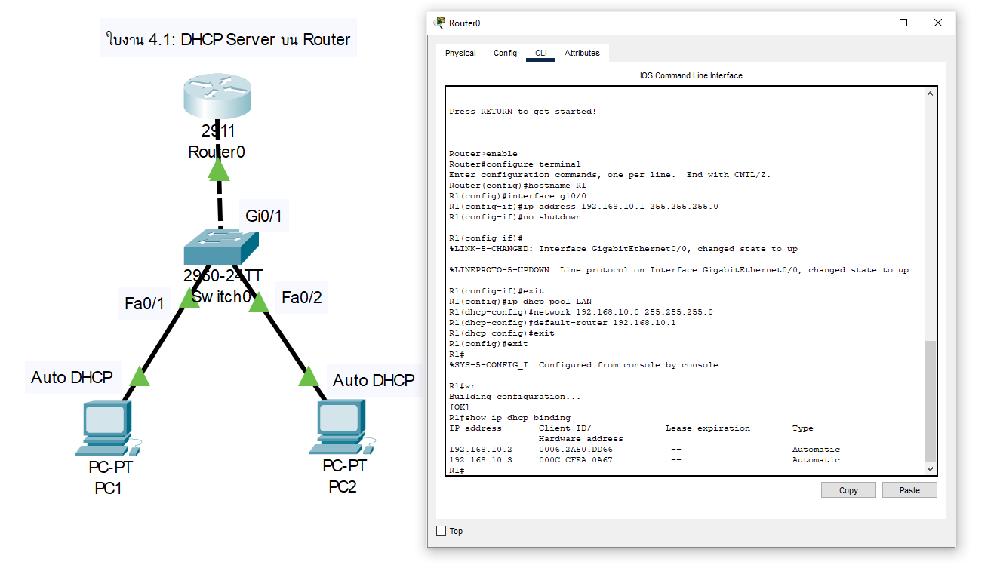
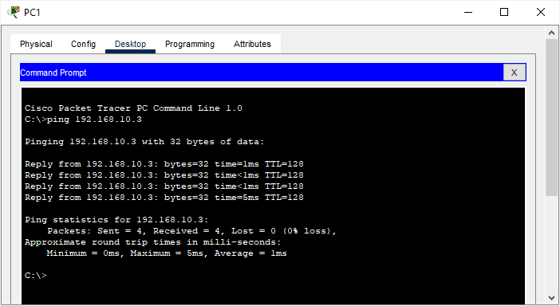

# ใบงานการตั้งค่าเครือข่ายใน Cisco Packet Tracer v.8.2.2 (ต่อ)

เอกสารนี้ต่อจากส่วนที่เหลือของใบงานปฏิบัติการเครือข่ายสำหรับหัวข้อ **NAT** (Dynamic NAT) และ **Access Control List (ACL)** โดยใช้ Cisco Packet Tracer v.8.2.2 ระดับความยากปานกลางถึงยาก

## 4. DHCP (2 ใบงาน)

### ใบงาน 4.1: DHCP Server บน Router
**วัตถุประสงค์**: ตั้งค่า DHCP Server เพื่อแจก IP ให้ PC  
**อุปกรณ์ที่ใช้**:
- Router: Cisco 2911 (1 ตัว, R1)
- Switch: Cisco 2960-24TT (1 ตัว, SW1)
- PC: 2 เครื่อง (PC1, PC2)

**การเชื่อมต่อสาย**:
- PC1 --(Straight-through)--> SW1 (Fa0/1)
- PC2 --(Straight-through)--> SW1 (Fa0/2)
- SW1 (Gi0/1) --(Cross-over)--> R1 (Gi0/0)

**การกำหนด IP Address, Subnet, Gateway**:
- PC1: DHCP (คาดว่าได้ 192.168.10.2/24, Gateway: 192.168.10.1)
- PC2: DHCP (คาดว่าได้ 192.168.10.3/24, Gateway: 192.168.10.1)
- R1: Gi0/0 = 192.168.10.1/24

**ภาพการเชื่อมต่อ (Text)**:
```
[PC1] -- [SW1 (Fa0/1)]
[PC2] -- [SW1 (Fa0/2)]
          [SW1 (Gi0/1)] -- [R1 (Gi0/0)]
```


**การกำหนดชื่อและการตั้งค่า**:
- **R1**:
```powershell
Router>enable
Router#configure terminal
Router(config)#hostname R1
R1(config)#interface gi0/0
R1(config-if)#ip address 192.168.10.1 255.255.255.0
R1(config-if)#no shutdown
R1(config-if)#exit
R1(config)#ip dhcp pool LAN
R1(dhcp-config)#network 192.168.10.0 255.255.255.0
R1(dhcp-config)#default-router 192.168.10.1
R1(dhcp-config)#exit
R1(config)#exit
R1#wr
```
- **SW1**:
```powershell
Switch>enable
Switch#configure terminal
Switch(config)#hostname SW1
SW1(config)#interface fa0/1
SW1(config-if)#switchport mode access
SW1(config-if)#switchport access vlan 1
SW1(config-if)#exit
SW1(config)#interface fa0/2
SW1(config-if)#switchport mode access
SW1(config-if)#switchport access vlan 1
SW1(config-if)#exit
SW1(config)#interface gi0/1
SW1(config-if)#switchport mode access
SW1(config-if)#switchport access vlan 1
SW1(config-if)#exit
SW1(config)#exit
SW1#wr
```

**การทดสอบการทำงาน**:
- ใช้คำสั่ง `show ip dhcp binding` บน R1 เพื่อยืนยันว่า PC1 และ PC2 ได้รับ IP
- จาก PC1 และ PC2 รัน `ipconfig` เพื่อยืนยัน IP และ Gateway
- จาก PC1 ping PC2 (ควรสำเร็จ)




---

### ใบงาน 4.2: DHCP Relay Agent
**วัตถุประสงค์**: ตั้งค่า DHCP Relay เพื่อให้ PC ใน VLAN ต่างๆ ได้รับ IP  
**อุปกรณ์ที่ใช้**:
- Router: Cisco 2911 (2 ตัว, R1, R2)
- Switch: Cisco 2960-24TT (1 ตัว, SW1)
- PC: 2 เครื่อง (PC1, PC2)

**การเชื่อมต่อสาย**:
- PC1 --(Straight-through)--> SW1 (Fa0/1)
- PC2 --(Straight-through)--> SW1 (Fa0/2)
- SW1 (Fa0/24) --(Cross-over)--> R1 (Gi0/0)
- R1 (Gi0/1) --(Cross-over)--> R2 (Gi0/0)

**การกำหนด IP Address, Subnet, Gateway**:
- PC1: DHCP (คาดว่าได้ 192.168.10.2/24, Gateway: 192.168.10.1, VLAN 10)
- PC2: DHCP (คาดว่าได้ 192.168.20.2/24, Gateway: 192.168.20.1, VLAN 20)
- R1: Gi0/0.10 = 192.168.10.1/24, Gi0/0.20 = 192.168.20.1/24, Gi0/1 = 172.16.1.1/30
- R2: Gi0/0 = 192.168.30.1/24

**การกำหนดชื่อและการตั้งค่า**:
- **R1**:
```powershell
Would you like to enter the initial configuration dialog? [yes/no]: no
Router> enable
Router# configure terminal
Enter configuration commands, one per line.  End with CNTL/Z.
Router(config)# hostname R1

(  Configure sub-interfaces for VLANs )
R1(config)# interface gigabitethernet0/0.10
R1(config-subif)# encapsulation dot1Q 10
R1(config-subif)# ip address 192.168.10.1 255.255.255.0
R1(config-subif)# ip helper-address 192.168.30.1
R1(config-subif)# no shutdown
R1(config-subif)# exit

R1(config)# interface gigabitethernet0/0.20
R1(config-subif)# encapsulation dot1Q 20
R1(config-subif)# ip address 192.168.20.1 255.255.255.0
R1(config-subif)# ip helper-address 192.168.30.1
R1(config-subif)# no shutdown
R1(config-subif)# exit

(  Turn on the physical interface)
R1(config)# interface gigabitethernet0/0
R1(config-if)# no shutdown
R1(config-if)# exit

(  Configure the link to R2)
R1(config)# interface gigabitethernet0/1
R1(config-if)# ip address 172.16.1.1 255.255.255.252
R1(config-if)# no shutdown
R1(config-if)# exit

(  Static route to reach the DHCP server network)
R1(config)# ip route 192.168.30.0 255.255.255.0 172.16.1.2
R1(config)# exit

R1#wr
Building configuration...
[OK]
R1#
```
- **R2**:
```powershell
Would you like to enter the initial configuration dialog? [yes/no]: no
Router> enable
Router# configure terminal
Enter configuration commands, one per line.  End with CNTL/Z.
Router(config)# hostname R2

ความหมายคำสั่ง (Best Practice) Create a Loopback interface for the server IP
R2(config)# interface loopback0
R2(config-if)# ip address 192.168.30.1 255.255.255.0
R2(config-if)# no shutdown
R2(config-if)# exit

ความหมายคำสั่ง Configure the physical link to R1
R2(config)# interface gigabitethernet0/0
R2(config-if)# ip address 172.16.1.2 255.255.255.252
R2(config-if)# no shutdown
R2(config-if)# exit

ความหมายคำสั่ง Shutdown unused interface
R2(config)# interface gigabitethernet0/1
R2(config-if)# shutdown
R2(config-if)# exit

ความหมายคำสั่ง Configure DHCP pools
R2(config)# ip dhcp pool VLAN10
R2(dhcp-config)# network 192.168.10.0 255.255.255.0
R2(dhcp-config)# default-router 192.168.10.1
R2(dhcp-config)# exit

R2(config)# ip dhcp pool VLAN20
R2(dhcp-config)# network 192.168.20.0 255.255.255.0
R2(dhcp-config)# default-router 192.168.20.1
R2(dhcp-config)# exit

ความหมายคำสั่ง Static routes to reach the VLAN networks
R2(config)# ip route 192.168.10.0 255.255.255.0 172.16.1.1
R2(config)# ip route 192.168.20.0 255.255.255.0 172.16.1.1
R2(config)# exit

R2# copy running-config startup-config
Destination filename [startup-config]? 
Building configuration...
[OK]
R2#
```
- **SW1**:
```powershell
Switch> enable
Switch# configure terminal
Enter configuration commands, one per line.  End with CNTL/Z.
Switch(config)# hostname SW1

ความหมายคำสั่ง  Create VLANs
SW1(config)# vlan 10
SW1(config-vlan)# name SALES
SW1(config-vlan)# exit

SW1(config)# vlan 20
SW1(config-vlan)# name ENGINEERING
SW1(config-vlan)# exit

ความหมายคำสั่ง  Configure access port for PC1
SW1(config)# interface fastethernet0/1
SW1(config-if)# switchport mode access
SW1(config-if)# switchport access vlan 10
SW1(config-if)# exit

ความหมายคำสั่ง Configure access port for PC2
SW1(config)# interface fastethernet0/2
SW1(config-if)# switchport mode access
SW1(config-if)# switchport access vlan 20
SW1(config-if)# exit

ความหมายคำสั่ง  Configure trunk port to R1
SW1(config)# interface gigabitethernet0/1
SW1(config-if)# switchport mode trunk
SW1(config-if)# switchport trunk allowed vlan 10,20
SW1(config-if)# exit

SW1(config)# exit

SW1# copy running-config startup-config
Destination filename [startup-config]? 
Building configuration...
[OK]
SW1#
```

**การทดสอบการทำงาน**:
- ใช้คำสั่ง `show ip dhcp binding` บน R2 เพื่อยืนยันว่า PC1 และ PC2 ได้รับ IP
- จาก PC1 และ PC2 รัน `ipconfig` เพื่อยืนยัน IP และ Gateway
- จาก PC1 ping PC2 (ควรสำเร็จ)

**ภาพการเชื่อมต่อ (Text)**:
```
[PC1 (VLAN 10)] -- [SW1 (Fa0/1)]
[PC2 (VLAN 20)] -- [SW1 (Fa0/2)]
                    [SW1 (Gi0/1)] -- [R1 (Gi0/0)]
                                        [R1 (Gi0/1)] -- [R2 (Gi0/0)]
```

---

## 5. DHCP Snooping (2 ใบงาน)

### ใบงาน 5.1: DHCP Snooping พื้นฐาน
**วัตถุประสงค์**: ตั้งค่า DHCP Snooping เพื่อป้องกัน DHCP Server ปลอม  
**อุปกรณ์ที่ใช้**:
- Router: Cisco 2911 (1 ตัว, R1)
- Switch: Cisco 2960-24TT (1 ตัว, SW1)
- PC: 3 เครื่อง (PC1, PC2, PC3)

**การเชื่อมต่อสาย**:
- PC1 --(Straight-through)--> SW1 (Fa0/1)
- PC2 --(Straight-through)--> SW1 (Fa0/2)
- PC3 --(Straight-through)--> SW1 (Fa0/3)
- SW1 (Fa0/24) --(Cross-over)--> R1 (Gi0/0)

**การกำหนด IP Address, Subnet, Gateway**:
- PC1: DHCP (คาดว่าได้ 192.168.10.2/24, Gateway: 192.168.10.1)
- PC2: DHCP (คาดว่าได้ 192.168.10.3/24, Gateway: 192.168.10.1)
- PC3: DHCP Server ปลอม (192.168.10.100/24)
- R1: Gi0/0 = 192.168.10.1/24

**การกำหนดชื่อและการตั้งค่า**:
- **R1**:
```powershell
Router>enable
Router#configure terminal
Router(config)#hostname R1
R1(config)#interface gi0/0
R1(config-if)#ip address 192.168.10.1 255.255.255.0
R1(config-if)#no shutdown
R1(config-if)#exit
R1(config)#ip dhcp pool LAN
R1(dhcp-config)#network 192.168.10.0 255.255.255.0
R1(dhcp-config)#default-router 192.168.10.1
R1(dhcp-config)#exit
R1(config)#write memory
```
- **SW1**:
```powershell
Switch>enable
Switch#configure terminal
Switch(config)#hostname SW1
SW1(config)#ip dhcp snooping
SW1(config)#ip dhcp snooping vlan 1
SW1(config)#interface fa0/1
SW1(config-if)#switchport mode access
SW1(config-if)#switchport access vlan 1
SW1(config-if)#exit
SW1(config)#interface fa0/2
SW1(config-if)#switchport mode access
SW1(config-if)#switchport access vlan 1
SW1(config-if)#exit
SW1(config)#interface fa0/3
SW1(config-if)#switchport mode access
SW1(config-if)#switchport access vlan 1
SW1(config-if)#exit
SW1(config)#interface fa0/24
SW1(config-if)#switchport mode access
SW1(config-if)#switchport access vlan 1
SW1(config-if)#ip dhcp snooping trust
SW1(config-if)#exit
SW1(config)#write memory
```

**การทดสอบการทำงาน**:
- ใช้คำสั่ง `show ip dhcp snooping` บน SW1 เพื่อยืนยันว่า Fa0/24 เป็น Trusted Port
- ใช้คำสั่ง `show ip dhcp binding` บน R1 เพื่อยืนยันว่า PC1 และ PC2 ได้รับ IP
- ตั้งค่า PC3 เป็น DHCP Server ปลอมและตรวจสอบว่า PC1 และ PC2 ยังได้รับ IP จาก R1
- จาก PC1 ping PC2 (ควรสำเร็จ)

**ภาพการเชื่อมต่อ (Text)**:
```
[PC1] -- [SW1 (Fa0/1)]
[PC2] -- [SW1 (Fa0/2)]
[PC3] -- [SW1 (Fa0/3)]
          [SW1 (Fa0/24)] -- [R1 (Gi0/0)]
```

---

### ใบงาน 5.2: DHCP Snooping กับ VLAN
**วัตถุประสงค์**: ตั้งค่า DHCP Snooping สำหรับหลาย VLAN  
**อุปกรณ์ที่ใช้**:
- Router: Cisco 2911 (1 ตัว, R1)
- Switch: Cisco 2960-24TT (2 ตัว, SW1, SW2)
- PC: 3 เครื่อง (PC1, PC2, PC3)

**การเชื่อมต่อสาย**:
- PC1 --(Straight-through)--> SW1 (Fa0/1)
- PC2 --(Straight-through)--> SW2 (Fa0/1)
- PC3 --(Straight-through)--> SW2 (Fa0/2)
- SW1 (Fa0/24) --(Cross-over)--> SW2 (Fa0/24)
- SW1 (Fa0/23) --(Cross-over)--> R1 (Gi0/0)

**การกำหนด IP Address, Subnet, Gateway**:
- PC1: DHCP (คาดว่าได้ 192.168.10.2/24, Gateway: 192.168.10.1, VLAN 10)
- PC2: DHCP (คาดว่าได้ 192.168.20.2/24, Gateway: 192.168.20.1, VLAN 20)
- PC3: DHCP Server ปลอม (192.168.20.100/24, VLAN 20)
- R1: Gi0/0.10 = 192.168.10.1/24, Gi0/0.20 = 192.168.20.1/24

**การกำหนดชื่อและการตั้งค่า**:
- **R1**:
```powershell
Router>enable
Router#configure terminal
Router(config)#hostname R1
R1(config)#interface gi0/0.10
R1(config-subif)#encapsulation dot1Q 10
R1(config-subif)#ip address 192.168.10.1 255.255.255.0
R1(config-subif)#no shutdown
R1(config-subif)#exit
R1(config)#interface gi0/0.20
R1(config-subif)#encapsulation dot1Q 20
R1(config-subif)#ip address 192.168.20.1 255.255.255.0
R1(config-subif)#no shutdown
R1(config-subif)#exit
R1(config)#interface gi0/0
R1(config-if)#no shutdown
R1(config-if)#exit
R1(config)#ip dhcp pool VLAN10
R1(dhcp-config)#network 192.168.10.0 255.255.255.0
R1(dhcp-config)#default-router 192.168.10.1
R1(dhcp-config)#exit
R1(config)#ip dhcp pool VLAN20
R1(dhcp-config)#network 192.168.20.0 255.255.255.0
R1(dhcp-config)#default-router 192.168.20.1
R1(dhcp-config)#exit
R1(config)#write memory
```
- **SW1**:
```powershell
Switch>enable
Switch#configure terminal
Switch(config)#hostname SW1
SW1(config)#vlan 10
SW1(config-vlan)#name SALES
SW1(config-vlan)#exit
SW1(config)#vlan 20
SW1(config-vlan)#name ENGINEERING
SW1(config-vlan)#exit
SW1(config)#ip dhcp snooping
SW1(config)#ip dhcp snooping vlan 10,20
SW1(config)#interface fa0/1
SW1(config-if)#switchport mode access
SW1(config-if)#switchport access vlan 10
SW1(config-if)#exit
SW1(config)#interface fa0/23
SW1(config-if)#switchport mode trunk
SW1(config-if)#switchport trunk allowed vlan 10,20
SW1(config-if)#switchport trunk native vlan 10
SW1(config-if)#ip dhcp snooping trust
SW1(config-if)#exit
SW1(config)#interface fa0/24
SW1(config-if)#switchport mode trunk
SW1(config-if)#switchport trunk allowed vlan 10,20
SW1(config-if)#switchport trunk native vlan 10
SW1(config-if)#exit
SW1(config)#write memory
```
- **SW2**:
```powershell
Switch>enable
Switch#configure terminal
Switch(config)#hostname SW2
SW2(config)#vlan 10
SW2(config-vlan)#name SALES
SW2(config-vlan)#exit
SW2(config)#vlan 20
SW2(config-vlan)#name ENGINEERING
SW2(config-vlan)#exit
SW2(config)#ip dhcp snooping
SW2(config)#ip dhcp snooping vlan 10,20
SW2(config)#interface fa0/1
SW2(config-if)#switchport mode access
SW2(config-if)#switchport access vlan 20
SW2(config-if)#exit
SW2(config)#interface fa0/2
SW2(config-if)#switchport mode access
SW2(config-if)#switchport access vlan 20
SW2(config-if)#exit
SW2(config)#interface fa0/24
SW2(config-if)#switchport mode trunk
SW2(config-if)#switchport trunk allowed vlan 10,20
SW2(config-if)#switchport trunk native vlan 10
SW2(config-if)#exit
SW2(config)#write memory
```

**การทดสอบการทำงาน**:
- ใช้คำสั่ง `show ip dhcp snooping` บน SW1 และ SW2 เพื่อยืนยันว่า Fa0/23 บน SW1 เป็น Trusted Port
- ใช้คำสั่ง `show ip dhcp binding` บน R1 เพื่อยืนยันว่า PC1 และ PC2 ได้รับ IP
- ตั้งค่า PC3 เป็น DHCP Server ปลอมและตรวจสอบว่า PC2 ยังได้รับ IP จาก R1
- จาก PC1 ping PC2 (ควรสำเร็จ)

**ภาพการเชื่อมต่อ (Text)**:
```
[PC1 (VLAN 10)] -- [SW1 (Fa0/1)]
                    [SW1 (Fa0/24)] -- [SW2 (Fa0/24)]
[PC2 (VLAN 20)] -- [SW2 (Fa0/1)]
[PC3 (VLAN 20)] -- [SW2 (Fa0/2)]
                    [SW1 (Fa0/23)] -- [R1 (Gi0/0)]
```

---

## 6. Loop Guard (1 ใบงาน)

### ใบงาน 6.1: การตั้งค่า Loop Guard
**วัตถุประสงค์**: ตั้งค่า Loop Guard เพื่อป้องกัน Loop ในเครือข่าย  
**อุปกรณ์ที่ใช้**:
- Switch: Cisco 3560-24PS (2 ตัว, SW1, SW2)
- PC: 2 เครื่อง (PC1, PC2)

**การเชื่อมต่อสาย**:
- PC1 --(Straight-through)--> SW1 (Fa0/1)
- PC2 --(Straight-through)--> SW2 (Fa0/1)
- SW1 (Fa0/23) --(Cross-over)--> SW2 (Fa0/23)
- SW1 (Fa0/24) --(Cross-over)--> SW2 (Fa0/24)

**การกำหนด IP Address, Subnet, Gateway**:
- PC1: 192.168.10.2/24, Gateway: 192.168.10.1 (VLAN 10)
- PC2: 192.168.10.3/24, Gateway: 192.168.10.1 (VLAN 10)

**การกำหนดชื่อและการตั้งค่า**:
- **SW1**:
```plaintext
Switch>enable
Switch#configure terminal
Switch(config)#hostname SW1
SW1(config)#vlan 10
SW1(config-vlan)#name LAN
SW1(config-vlan)#exit
SW1(config)#spanning-tree mode rapid-pvst
SW1(config)#spanning-tree vlan 10 priority 4096
SW1(config)#spanning-tree loopguard default
SW1(config)#interface fa0/1
SW1(config-if)#switchport mode access
SW1(config-if)#switchport access vlan 10
SW1(config-if)#exit
SW1(config)#interface range fa0/23 - 24
SW1(config-if-range)#switchport mode trunk
SW1(config-if-range)#switchport trunk allowed vlan 10
SW1(config-if-range)#switchport trunk native vlan 10
SW1(config-if-range)#exit
SW1(config)#write memory
```
- **SW2**:
```plaintext
Switch>enable
Switch#configure terminal
Switch(config)#hostname SW2
SW2(config)#vlan 10
SW2(config-vlan)#name LAN
SW2(config-vlan)#exit
SW2(config)#spanning-tree mode rapid-pvst
SW2(config)#spanning-tree vlan 10 priority 8192
SW2(config)#spanning-tree loopguard default
SW2(config)#interface fa0/1
SW2(config-if)#switchport mode access
SW2(config-if)#switchport access vlan 10
SW2(config-if)#exit
SW2(config)#interface range fa0/23 - 24
SW2(config-if-range)#switchport mode trunk
SW2(config-if-range)#switchport trunk allowed vlan 10
SW2(config-if-range)#switchport trunk native vlan 10
SW2(config-if-range)#exit
SW2(config)#write memory
```

**การทดสอบการทำงาน**:
- ใช้คำสั่ง `show spanning-tree vlan 10` เพื่อยืนยันว่า SW1 เป็น Root Bridge และ Fa0/24 บน SW2 อยู่ในสถานะ Blocking
- ปิดการส่ง BPDU บน SW2 (Fa0/23) โดยใช้ `spanning-tree bpdufilter enable` และตรวจสอบว่า Loop Guard ทำให้พอร์ตเข้าสู่สถานะ Err-disabled
- จาก PC1 ping PC2 (ควรสำเร็จก่อนและหลังการทดสอบ Loop Guard)

**ภาพการเชื่อมต่อ (Text)**:
```
[PC1 (VLAN 10)] -- [SW1 (Fa0/1)] -- [Fa0/24] -- [SW2 (Fa0/24)] -- [PC2 (VLAN 10)]
                    |                                  |
                    +----[Fa0/23]----[Fa0/23]--+
```

---

## 7. Spanning Tree (1 ใบงาน)

### ใบงาน 7.1: Rapid Per-VLAN Spanning Tree (RPVST)
**วัตถุประสงค์**: ตั้งค่า RPVST เพื่อป้องกัน Loop  
**อุปกรณ์ที่ใช้**:
- Switch: Cisco 2960-24TT (2 ตัว, SW1, SW2)
- PC: 2 เครื่อง (PC1, PC2)

**การเชื่อมต่อสาย**:
- PC1 --(Straight-through)--> SW1 (Fa0/1)
- PC2 --(Straight-through)--> SW2 (Fa0/1)
- SW1 (Fa0/23) --(Cross-over)--> SW2 (Fa0/23)
- SW1 (Fa0/24) --(Cross-over)--> SW2 (Fa0/24)

**การกำหนด IP Address, Subnet, Gateway**:
- PC1: 192.168.10.2/24, Gateway: 192.168.10.1 (VLAN 10)
- PC2: 192.168.10.3/24, Gateway: 192.168.10.1 (VLAN 10)

**การกำหนดชื่อและการตั้งค่า**:
- **SW1**:
```plaintext
Switch>enable
Switch#configure terminal
Switch(config)#hostname SW1
SW1(config)#vlan 10
SW1(config-vlan)#name LAN
SW1(config-vlan)#exit
SW1(config)#spanning-tree mode rapid-pvst
SW1(config)#spanning-tree vlan 10 priority 4096
SW1(config)#interface fa0/1
SW1(config-if)#switchport mode access
SW1(config-if)#switchport access vlan 10
SW1(config-if)#exit
SW1(config)#interface range fa0/23 - 24
SW1(config-if-range)#switchport mode trunk
SW1(config-if-range)#switchport trunk allowed vlan 10
SW1(config-if-range)#switchport trunk native vlan 10
SW1(config-if-range)#exit
SW1(config)#write memory
```
- **SW2**:
```plaintext
Switch>enable
Switch#configure terminal
Switch(config)#hostname SW2
SW2(config)#vlan 10
SW2(config-vlan)#name LAN
SW2(config-vlan)#exit
SW2(config)#spanning-tree mode rapid-pvst
SW2(config)#spanning-tree vlan 10 priority 8192
SW2(config)#interface fa0/1
SW2(config-if)#switchport mode access
SW2(config-if)#switchport access vlan 10
SW2(config-if)#exit
SW2(config)#interface range fa0/23 - 24
SW2(config-if-range)#switchport mode trunk
SW2(config-if-range)#switchport trunk allowed vlan 10
SW2(config-if-range)#switchport trunk native vlan 10
SW2(config-if-range)#exit
SW2(config)#write memory
```

**การทดสอบการทำงาน**:
- ใช้คำสั่ง `show spanning-tree vlan 10` เพื่อยืนยันว่า SW1 เป็น Root Bridge และ Fa0/24 บน SW2 อยู่ในสถานะ Blocking
- จาก PC1 ping PC2 (ควรสำเร็จ)
- ปิดพอร์ต Fa0/23 บน SW2 และตรวจสอบว่า Fa0/24 เปลี่ยนเป็น Forwarding

**ภาพการเชื่อมต่อ (Text)**:
```
[PC1 (VLAN 10)] -- [SW1 (Fa0/1)] -- [Fa0/24] -- [SW2 (Fa0/24)] -- [PC2 (VLAN 10)]
                    |                                  |
                    +----[Fa0/23]----[Fa0/23]--+
```

---

## 8. Link Aggregation (1 ใบงาน)

### ใบงาน 8.1: EtherChannel (LACP)
**วัตถุประสงค์**: ตั้งค่า EtherChannel เพื่อเพิ่มแบนด์วิดท์ระหว่างสวิตช์  
**อุปกรณ์ที่ใช้**:
- Switch: Cisco 2960-24TT (2 ตัว, SW1, SW2)
- PC: 2 เครื่อง (PC1, PC2)

**การเชื่อมต่อสาย**:
- PC1 --(Straight-through)--> SW1 (Fa0/1)
- PC2 --(Straight-through)--> SW2 (Fa0/1)
- SW1 (Fa0/23) --(Cross-over)--> SW2 (Fa0/23)
- SW1 (Fa0/24) --(Cross-over)--> SW2 (Fa0/24)

**การกำหนด IP Address, Subnet, Gateway**:
- PC1: 192.168.10.2/24, Gateway: 192.168.10.1 (VLAN 10)
- PC2: 192.168.10.3/24, Gateway: 192.168.10.1 (VLAN 10)

**การกำหนดชื่อและการตั้งค่า**:
- **SW1**:
```plaintext
Switch>enable
Switch#configure terminal
Switch(config)#hostname SW1
SW1(config)#vlan 10
SW1(config-vlan)#name LAN
SW1(config-vlan)#exit
SW1(config)#interface fa0/1
SW1(config-if)#switchport mode access
SW1(config-if)#switchport access vlan 10
SW1(config-if)#exit
SW1(config)#interface range fa0/23 - 24
SW1(config-if-range)#channel-group 1 mode active
SW1(config-if-range)#switchport mode trunk
SW1(config-if-range)#switchport trunk allowed vlan 10
SW1(config-if-range)#switchport trunk native vlan 10
SW1(config-if-range)#exit
SW1(config)#write memory
```
- **SW2**:
```plaintext
Switch>enable
Switch#configure terminal
Switch(config)#hostname SW2
SW2(config)#vlan 10
SW2(config-vlan)#name LAN
SW2(config-vlan)#exit
SW2(config)#interface fa0/1
SW2(config-if)#switchport mode access
SW2(config-if)#switchport access vlan 10
SW2(config-if)#exit
SW2(config)#interface range fa0/23 - 24
SW2(config-if-range)#channel-group 1 mode active
SW2(config-if-range)#switchport mode trunk
SW2(config-if-range)#switchport trunk allowed vlan 10
SW2(config-if-range)#switchport trunk native vlan 10
SW2(config-if-range)#exit
SW2(config)#write memory
```

**การทดสอบการทำงาน**:
- ใช้คำสั่ง `show etherchannel summary` เพื่อยืนยันว่า Port-channel 1 ทำงาน
- จาก PC1 ping PC2 (ควรสำเร็จ)
- ปิดพอร์ต Fa0/23 บน SW1 และตรวจสอบว่า ping ยังทำงานได้ (EtherChannel ยังคงทำงานผ่าน Fa0/24)

**ภาพการเชื่อมต่อ (Text)**:
```
[PC1 (VLAN 10)] -- [SW1 (Fa0/1)] -- [Fa0/24 (EtherChannel)] -- [SW2 (Fa0/24)] -- [PC2 (VLAN 10)]
                    |                                     |
                    +----[Fa0/23 (EtherChannel)]----[Fa0/23]--+
```

---