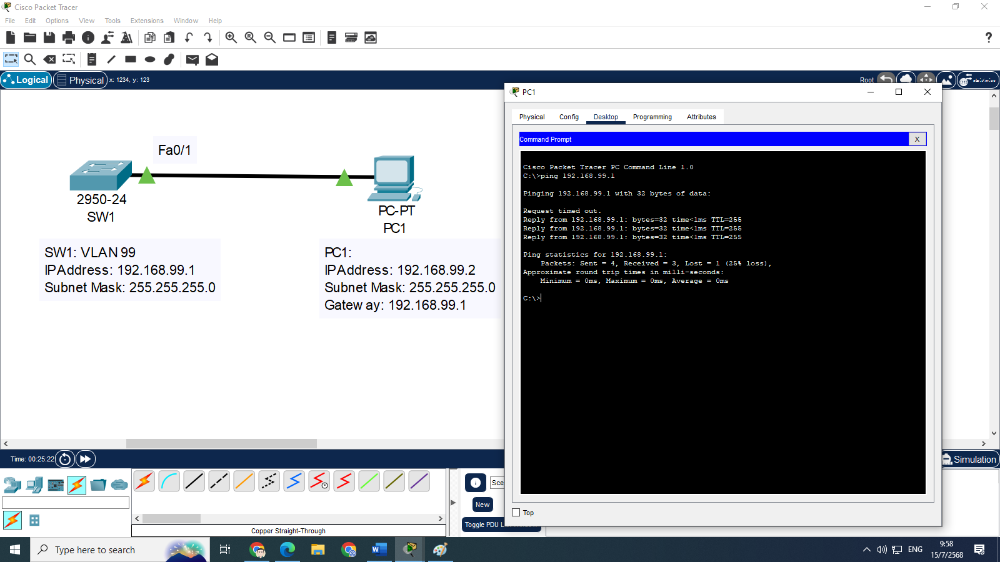

# ใบงานการตั้งค่าเครือข่ายใน Cisco Packet Tracer (v.8.2.2)

เอกสารนี้ประกอบด้วยใบงานปฏิบัติการเครือข่ายสำหรับหัวข้อ VLAN

---

## 1. VLAN 


### ใบงาน 1.1: การกำหนด VLAN Management
**วัตถุประสงค์**: ตั้งค่า VLAN Management เพื่อจัดการสวิตช์  
**อุปกรณ์ที่ใช้**:
- Switch: Cisco 2960-24TT (1 ตัว, SW1)
- PC: 1 เครื่อง (PC1)

**การเชื่อมต่อสาย**:
- PC1 --(Straight-through)--> SW1 (Fa0/1)

### ภาพไดอะแกรม




**การกำหนด IP Address, Subnet, Gateway**:
- PC1: 192.168.99.2/24, Gateway: 192.168.99.1
- SW1: VLAN 99 = 192.168.99.1/24

**การกำหนดชื่อและการตั้งค่า**:
```plaintext
Switch>enable
Switch#configure terminal
Switch(config)#hostname SW1
SW1(config)#vlan 99
SW1(config-vlan)#name MANAGEMENT
SW1(config-vlan)#exit
SW1(config)#interface vlan 99
SW1(config-if)#ip address 192.168.99.1 255.255.255.0
SW1(config-if)#no shutdown
SW1(config-if)#exit
SW1(config)#ip default-gateway 192.168.99.1
SW1(config)#interface fa0/1
SW1(config-if)#switchport mode access
SW1(config-if)#switchport access vlan 99
SW1(config-if)#exit
SW1(config)#exit
SW1#wr
```

**การทดสอบการทำงาน**:
- ใช้คำสั่ง `show vlan brief` เพื่อยืนยันว่า VLAN 99 มี Fa0/1
- ใช้คำสั่ง `show ip interface brief` เพื่อยืนยันว่า VLAN 99 อยู่ในสถานะ up
- จาก PC1 ping 192.168.99.1 (ควรสำเร็จ)

**ภาพการเชื่อมต่อ (Text)**:
```
[PC1 (VLAN 99)] -- [SW1 (Fa0/1)]
```

---


---

###  1.5: การกำหนด VLAN ด้วย Voice VLAN

**วัตถุประสงค์**:  
ตั้งค่า VLAN สำหรับ Data (VLAN 10) และ Voice (VLAN 20) โดยให้ PC อยู่ใน VLAN 10 และ IP Phone อยู่ใน VLAN 20 พร้อมทั้งตั้งค่า DHCP เพื่อแจก IP Address ให้ IP Phone และทดสอบการทำงานของ Voice VLAN

**ระดับความยาก**: ปานกลางถึงยาก

---

## อุปกรณ์ที่ใช้
- **Switch**: Cisco 2960-24TT (1 ตัว, ชื่อ SW1)
- **Router**: Cisco 2911 (1 ตัว, ชื่อ R1) เพื่อทำหน้าที่ DHCP Server
- **PC**: 2 เครื่อง (PC1, PC2)
- **IP Phone**: Cisco 7960 (2 ตัว, Phone1, Phone2)

## การเชื่อมต่อสาย
- PC1 --(Straight-through)--> Phone1 (พอร์ต PC) --(Straight-through)--> SW1 (Fa0/1)
- PC2 --(Straight-through)--> Phone2 (พอร์ต PC) --(Straight-through)--> SW1 (Fa0/2)
- SW1 (Fa0/24) --(Cross-over)--> R1 (Gi0/0)


### ภาพไดอะแกรม


## การกำหนด IP Address, Subnet, Gateway
- **PC1**: 192.168.10.2/24, Gateway: 192.168.10.1 (VLAN 10)
- **PC2**: 192.168.10.3/24, Gateway: 192.168.10.1 (VLAN 10)
- **Phone1**: DHCP (คาดว่าได้ 192.168.20.2/24, Gateway: 192.168.20.1, VLAN 20)
- **Phone2**: DHCP (คาดว่าได้ 192.168.20.3/24, Gateway: 192.168.20.1, VLAN 20)
- **R1**:
  - Gi0/0.10 = 192.168.10.1/24 (VLAN 10)
  - Gi0/0.20 = 192.168.20.1/24 (VLAN 20)

## การกำหนดชื่อและการตั้งค่า

### การตั้งค่า SW1
```plaintext
SW1>enable
SW1#configure terminal
SW1(config)#hostname SW1
SW1(config)#vlan 10
SW1(config-vlan)#name DATA
SW1(config-vlan)#exit
SW1(config)#vlan 20
SW1(config-vlan)#name VOICE
SW1(config-vlan)#exit
SW1(config)#interface fa0/1
SW1(config-if)#switchport mode access
SW1(config-if)#switchport access vlan 10
SW1(config-if)#switchport voice vlan 20
SW1(config-if)#spanning-tree portfast
SW1(config-if)#exit
SW1(config)#interface fa0/2
SW1(config-if)#switchport mode access
SW1(config-if)#switchport access vlan 10
SW1(config-if)#switchport voice vlan 20
SW1(config-if)#spanning-tree portfast
SW1(config-if)#exit
SW1(config)#interface fa0/24
SW1(config-if)#switchport mode trunk
SW1(config-if)#switchport trunk allowed vlan 10,20
SW1(config-if)#switchport trunk native vlan 10
SW1(config-if)#exit
SW1(config)#cdp run
SW1(config)#exit
SW1#wr
```

### การตั้งค่า R1 (DHCP Server และ Inter-VLAN Routing)
```plaintext
R1>enable
R1#configure terminal
R1(config)#hostname R1
R1(config)#interface gi0/0.10
R1(config-subif)#encapsulation dot1Q 10
R1(config-subif)#ip address 192.168.10.1 255.255.255.0
R1(config-subif)#no shutdown
R1(config-subif)#exit
R1(config)#interface gi0/0.20
R1(config-subif)#encapsulation dot1Q 20
R1(config-subif)#ip address 192.168.20.1 255.255.255.0
R1(config-subif)#no shutdown
R1(config-subif)#exit
R1(config)#interface gi0/0
R1(config-if)#no shutdown
R1(config-if)#exit
R1(config)#ip dhcp pool DATA
R1(dhcp-config)#network 192.168.10.0 255.255.255.0
R1(dhcp-config)#default-router 192.168.10.1
R1(dhcp-config)#exit
R1(config)#ip dhcp pool VOICE
R1(dhcp-config)#network 192.168.20.0 255.255.255.0
R1(dhcp-config)#default-router 192.168.20.1
R1(dhcp-config)#option 150 ip 192.168.20.1
R1(dhcp-config)#exit
R1(config)#ip dhcp excluded-address 192.168.20.1
R1(config)#cdp run
R1(config)#exit
R1#wr
```

Note
* รัน show ip dhcp binding บน R1 เพื่อยืนยันว่า Phone1 และ Phone2 ได้ IP
* รัน show cdp neighbors detail บน SW1 เพื่อยืนยันว่า IP Phone อยู่ใน VLAN 20
pc1 : ping 192.168.10.3
pc1 : ping 192.168.20.1
pc1 : ping 192.168.20.2

R1#show ip dhcp binding
SW1#show cdp neighbors


### การตั้งค่า PC1 และ PC2
1. เปิด PC1 ใน Packet Tracer:
   - ไปที่แท็บ **Desktop** > **IP Configuration**
   - ตั้งค่า:
     - IP Address: 192.168.10.2
     - Subnet Mask: 255.255.255.0
     - Default Gateway: 192.168.10.1
2. เปิด PC2 ใน Packet Tracer:
   - ทำเช่นเดียวกัน ตั้งค่า:
     - IP Address: 192.168.10.3
     - Subnet Mask: 255.255.255.0
     - Default Gateway: 192.168.10.1
3. (ตัวเลือก) หากต้องการใช้ DHCP สำหรับ PC1 และ PC2:
   - ตั้งค่า IP Configuration เป็น **DHCP** และตรวจสอบว่าได้รับ IP จาก DHCP Pool DATA (192.168.10.0/24)

### การตั้งค่า IP Phone Cisco 7960 (Phone1 และ Phone2)
ใน Cisco Packet Tracer, IP Phone Cisco 7960 จะรับการตั้งค่า VLAN และ IP Address อัตโนมัติผ่าน **CDP (Cisco Discovery Protocol)** และ **DHCP** หากสวิตช์และ DHCP Server ตั้งค่าถูกต้อง ต่อไปนี้คือขั้นตอน:

1. **เพิ่ม IP Phone ใน Packet Tracer**:
   - ลาก Cisco 7960 IP Phone (Phone1 และ Phone2) ไปวางในพื้นที่ทำงาน
   - เชื่อมต่อสาย:
     - PC1 --> Phone1 (พอร์ต PC) ด้วยสาย Straight-through
     - Phone1 --> SW1 (Fa0/1) ด้วยสาย Straight-through
     - PC2 --> Phone2 (พอร์ต PC) ด้วยสาย Straight-through
     - Phone2 --> SW1 (Fa0/2) ด้วยสาย Straight-through

2. **ตรวจสอบและกำหนดการตั้งค่า IP Phone**:
   - คลิกที่ Phone1 เพื่อเปิดหน้าต่าง GUI
   - ไปที่แท็บ **Config**:
     - **DHCP Enabled**: ตั้งเป็น **Yes**
     - **VLAN ID**: ควรแสดงเป็น 20 (รับจาก `switchport voice vlan 20` บน SW1)
     - **Operational VLAN ID**: ควรเป็น 20
     - **IP Address**: ควรได้รับ 192.168.20.2/24
     - **Subnet Mask**: 255.255.255.0
     - **Default Router**: 192.168.20.1
     - **TFTP Server**: 192.168.20.1 (จาก `option 150`)
   - ทำเช่นเดียวกันกับ Phone2 (คาดว่าได้ IP 192.168.20.3/24)
   - หาก IP Phone ไม่ได้รับ IP:
     - คลิก **Reset** ใน GUI ของ IP Phone
     - ตรวจสอบว่า DHCP Pool VOICE บน R1 ทำงาน และ Fa0/24 บน SW1 อนุญาต VLAN 20

## การทดสอบการทำงาน
1. **ตรวจสอบ VLAN บน SW1**:
   - รันคำสั่ง:
     ```plaintext
     show vlan brief
     ```
     - ผลลัพธ์ควรแสดง:
       - VLAN 10 (DATA): มี Fa0/1, Fa0/2
       - VLAN 20 (VOICE): อาจไม่แสดงพอร์ต (เนื่องจากเป็น Voice VLAN)
   - รันคำสั่ง:
     ```plaintext
     show running-config | section interface fa0/1
     show running-config | section interface fa0/2
     ```
     - ตรวจสอบว่า `switchport access vlan 10` และ `switchport voice vlan 20` ถูกตั้งไว้
   - รันคำสั่ง:
     ```plaintext
     show interfaces trunk
     ```
     - ตรวจสอบว่า Fa0/24 อนุญาต VLAN 10, 20 และ Native VLAN เป็น 10

2. **ตรวจสอบ DHCP บน R1**:
   - รันคำสั่ง:
     ```plaintext
     show ip dhcp binding
     ```
     - ผลลัพธ์ควรแสดง:
       ```plaintext
       IP address       Client-ID/              Lease expiration        Type
                        Hardware address
       192.168.20.2     0001.2345.6789         --                      Automatic
       192.168.20.3     0001.2345.6790         --                      Automatic
       ```
     - รันคำสั่ง:
       ```plaintext
       show ip dhcp pool VOICE
       ```
       - ตรวจสอบว่า Pool VOICE มี IP ว่างและแจก IP ถูกต้อง

3. **ตรวจสอบ IP Phone**:
   - ใน GUI ของ Phone1 และ Phone2 (แท็บ **Config** หรือ **Desktop**):
     - ตรวจสอบว่า Phone1 ได้ IP 192.168.20.2/24, Gateway 192.168.20.1
     - ตรวจสอบว่า Phone2 ได้ IP 192.168.20.3/24, Gateway 192.168.20.1
     - ตรวจสอบว่า **VLAN ID** และ **Operational VLAN ID** เป็น 20
     - หากมีสถานะ "Registered" หรือ "Configured" แปลว่า IP Phone ทำงานใน Voice VLAN

4. **ทดสอบการสื่อสาร**:
   - **ระหว่าง PC**:
     - จาก PC1 ping PC2 (192.168.10.3):
       - ไปที่แท็บ **Desktop** > **Command Prompt** บน PC1
       - รัน: `ping 192.168.10.3`
       - **ผลลัพธ์**: ควรสำเร็จ (อยู่ใน VLAN 10 เดียวกัน)
   - **ระหว่าง IP Phone**:
     - ใน Packet Tracer, Cisco 7960 IP Phone ไม่รองรับการ ping โดยตรง
     - ตรวจสอบการเชื่อมต่อโดยดูสถานะ IP และ VLAN ใน GUI
     - หากต้องการทดสอบ VoIP (จำลองการโทร):
       - คลิก Phone1 และ Phone2 ในแท็บ **Desktop**
       - ลองกดตัวเลข (เช่น 1000 สำหรับ Phone1, 1001 สำหรับ Phone2) เพื่อจำลองการโทร
       - **หมายเหตุ**: Packet Tracer มีข้อจำกัดในการจำลอง VoIP เต็มรูปแบบ (อาจต้องใช้ Call Manager Express ซึ่งอยู่นอกขอบเขตแล็บนี้)
   - **ระหว่าง PC และ IP Phone**:
     - จาก PC1 ping Phone1 (192.168.20.2):
       - รัน: `ping 192.168.20.2`
       - **ผลลัพธ์**: ควรสำเร็จ (เนื่องจาก R1 ทำ Inter-VLAN Routing)
     - จาก PC2 ping Phone2 (192.168.20.3):
       - รัน: `ping 192.168.20.3`
       - **ผลลัพธ์**: ควรสำเร็จ

5. **ตรวจสอบ CDP**:
   - รันคำสั่งบน SW1:
     ```plaintext
     show cdp neighbors
     ```
     - ผลลัพธ์ควรแสดง:
       - Phone1 เชื่อมต่อที่ Fa0/1
       - Phone2 เชื่อมต่อที่ Fa0/2
       - R1 เชื่อมต่อที่ Fa0/24
     - CDP ช่วยให้ IP Phone รับข้อมูล Voice VLAN (VLAN 20)

## การแก้ปัญหา (ถ้ามี)
หากพบปัญหา เช่น IP Phone ไม่ได้รับ IP หรือ PC ไม่สามารถ ping กันได้:
1. **IP Phone ไม่ได้รับ IP**:
   - ตรวจสอบ DHCP Pool บน R1:
     - รัน `show ip dhcp pool VOICE` และ `show ip dhcp binding`
     - ตรวจสอบว่า Fa0/24 บน SW1 อยู่ใน VLAN 20 หรือเป็น Trunk Port
   - รีเซ็ต IP Phone:
     - ใน GUI ของ Phone1 และ Phone2 คลิก **Reset**
   - ตรวจสอบ CDP:
     - รัน `show cdp neighbors` เพื่อยืนยันว่า SW1 เห็น IP Phone
     - หากไม่เห็น ตรวจสอบว่าใช้สาย Straight-through และพอร์ตถูกต้อง

2. **PC ไม่ได้รับ IP (ถ้าใช้ DHCP)**:
   - ตรวจสอบ DHCP Pool DATA บน R1
   - ตรวจสอบว่า Fa0/1 และ Fa0/2 บน SW1 อยู่ใน VLAN 10 (`show vlan brief`)

3. **Ping ไม่สำเร็จ**:
   - ตรวจสอบสถานะพอร์ต:
     - รัน `show interfaces status` บน SW1 เพื่อยืนยันว่า Fa0/1, Fa0/2, และ Fa0/24 เป็น **connected**
   - ตรวจสอบ Trunk Port:
     - รัน `show interfaces trunk` เพื่อยืนยันว่า Fa0/24 อนุญาต VLAN 10, 20
   - ตรวจสอบ Inter-VLAN Routing:
     - รัน `show ip interface brief` บน R1 เพื่อยืนยันว่า Gi0/0.10 และ Gi0/0.20 อยู่ในสถานะ **up/up**

4. **Voice VLAN ไม่ทำงาน**:
   - ตรวจสอบว่า `switchport voice vlan 20` ถูกตั้งไว้บน Fa0/1 และ Fa0/2
   - ตรวจสอบ GUI ของ IP Phone ว่ามี VLAN ID = 20

## ภาพการเชื่อมต่อ (Text)
```
[PC1] -- [Phone1 (VLAN 20)] -- [SW1 (Fa0/1, VLAN 10/20)]
[PC2] -- [Phone2 (VLAN 20)] -- [SW1 (Fa0/2, VLAN 10/20)]
                    [SW1 (Fa0/24, Trunk VLAN 10,20)] -- [R1 (Gi0/0)]
```

## หมายเหตุ
- **ข้อจำกัดของ Packet Tracer**: Cisco 7960 IP Phone ใน Packet Tracer ไม่สามารถจำลองการโทร VoIP ได้เต็มรูปแบบ (ต้องใช้ Call Manager Express หรือ TFTP Server จริง) การทดสอบจึงเน้นที่การรับ IP และการกำหนด Voice VLAN
- **DHCP สำหรับ PC**: ในแล็บนี้ PC1 และ PC2 ใช้ Static IP เพื่อลดความซับซ้อน แต่สามารถเปลี่ยนเป็น DHCP ได้โดยใช้ DHCP Pool DATA บน R1
- **CDP**: จำเป็นสำหรับ IP Phone เพื่อรับ Voice VLAN ตรวจสอบว่า CDP ไม่ถูกปิด (`no cdp run`) บน SW1
- **การเพิ่มความซับซ้อน**: หากต้องการเพิ่มการตั้งค่า เช่น การจำลอง VoIP, การเพิ่ม ACL เพื่อจำกัดการเข้าถึง Voice VLAN, หรือการใช้ Router-on-a-Stick แบบเต็มรูปแบบ กรุณาแจ้งเพิ่มเติม
