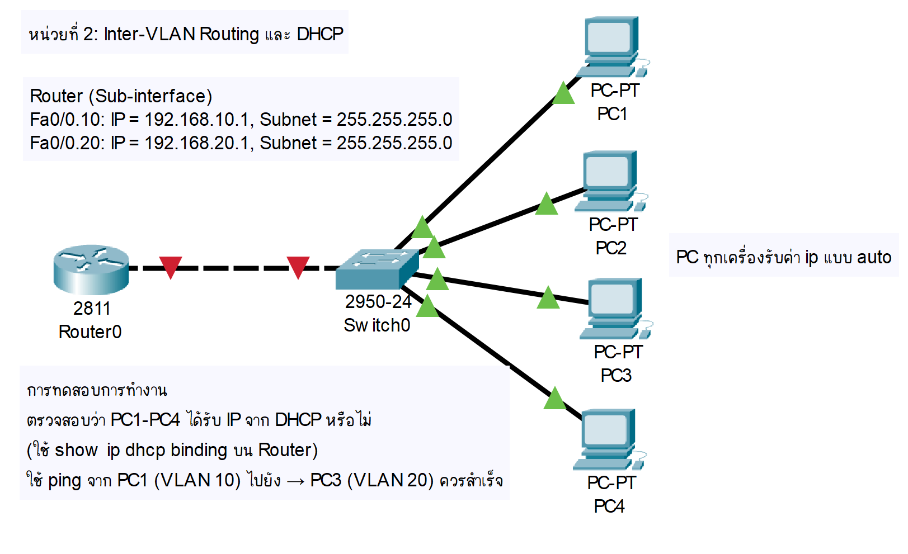

### หน่วยที่ 2: Inter-VLAN Routing และ DHCP

**หัวข้อ**

* การกำหนดค่า Inter-VLAN Routing ด้วย Router-on-a-Stick

* การตั้งค่า DHCP Server

* การทดสอบการรับ IP อัตโนมัติ

**ตัวอย่างแล็บ การตั้งค่า Inter-VLAN Routing และ DHCP**

#### อุปกรณ์ที่ใช้

* Router: Cisco 2811 (1 ตัว)

* Switch: Cisco 2950 (1 ตัว)

* PC: 4 เครื่อง

* สาย: สาย Straight-through และ Cross-over

#### การเชื่อมต่อสาย

```
PC1 --(Straight-through)--> Switch1 (Fa0/1)
PC2 --(Straight-through)--> Switch1 (Fa0/2)
PC3 --(Straight-through)--> Switch1 (Fa0/3)
PC4 --(Straight-through)--> Switch1 (Fa0/4)
Switch1 (Fa0/24) --(Cross-over)--> Router (Fa0/0)
```

#### การกำหนด IP Address, Subnet, Gateway

* PC1-PC4: รับ IP จาก DHCP

* Router (Sub-interface)

  * Fa0/0.10: IP = 192.168.10.1, Subnet = 255.255.255.0

  * Fa0/0.20: IP = 192.168.20.1, Subnet = 255.255.255.0

#### ภาพการเชื่อมต่อ (Text)

```
[PC1 (VLAN 10)] -- [SW1 (Fa0/1)] -- [Fa0/24 (Trunk)] -- [R1 (Fa0/0)]
[PC2 (VLAN 10)] -- [SW1 (Fa0/2)]
[PC3 (VLAN 20)] -- [SW1 (Fa0/3)]
[PC4 (VLAN 20)] -- [SW1 (Fa0/4)]
```

#### ภาพไดอะแกรม


#### การกำหนดชื่อและการตั้งค่า

**Router**

```
Router>enable
Router#configure terminal
Router(config)#hostname R1
R1(config)#interface fa0/0
R1(config-if)#no shutdown
R1(config-if)#exit
R1(config)#interface fa0/0.10
R1(config-subif)#encapsulation dot1Q 10
R1(config-subif)#ip address 192.168.10.1 255.255.255.0
R1(config-subif)#exit
R1(config)#interface fa0/0.20
R1(config-subif)#encapsulation dot1Q 20
R1(config-subif)#ip address 192.168.20.1 255.255.255.0
R1(config-subif)#exit
R1(config)#ip dhcp pool SALES
R1(config-dhcp)#network 192.168.10.0 255.255.255.0
R1(config-dhcp)#default-router 192.168.10.1
R1(config-dhcp)#exit
R1(config)#ip dhcp pool IT
R1(config-dhcp)#network 192.168.20.0 255.255.255.0
R1(config-dhcp)#default-router 192.168.20.1
R1(config-dhcp)#exit
```

**Switch**

```
Switch>enable
Switch#configure terminal
Switch(config)#hostname SW1
SW1(config)#vlan 10
SW1(config-vlan)#name SALES
SW1(config-vlan)#exit
SW1(config)#vlan 20
SW1(config-vlan)#name IT
SW1(config-vlan)#exit
SW1(config)#interface range fa0/1 - 2
SW1(config-if-range)#switchport mode access
SW1(config-if-range)#switchport access vlan 10
SW1(config-if-range)#exit
SW1(config)#interface range fa0/3 - 4
SW1(config-if-range)#switchport mode access
SW1(config-if-range)#switchport access vlan 20
SW1(config-if-range)#exit
SW1(config)#interface fa0/24
SW1(config-if)#switchport mode trunk
SW1(config-if)#exit
SW1(config)#wr
```

#### การทดสอบการทำงาน

* ตรวจสอบว่า PC1-PC4 ได้รับ IP จาก DHCP หรือไม่ (ใช้ show ip dhcp binding บน Router)

* ใช้ ping จาก PC1 (VLAN 10) ไปยัง →  PC3 (VLAN 20) ควรสำเร็จ

