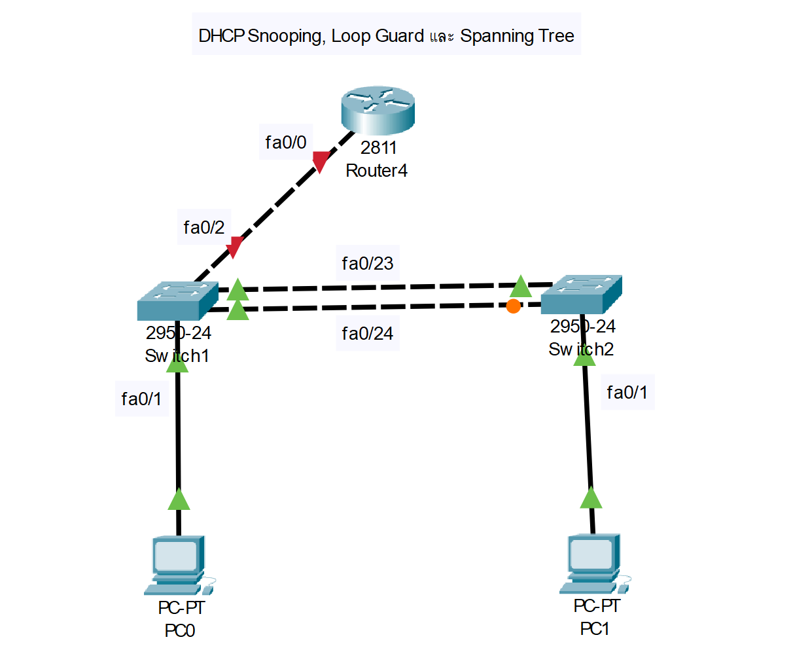

### หน่วยที่ 3: DHCP Snooping, Loop Guard และ Spanning Tree
**หัวข้อ:**
- การป้องกันการโจมตี DHCP ด้วย DHCP Snooping
- การป้องกัน Loop ด้วย Loop Guard และ Spanning Tree Protocol (STP)
- การตรวจสอบสถานะ STP

**ตัวอย่างแล็บ: การตั้งค่า DHCP Snooping และ STP**

#### อุปกรณ์ที่ใช้
- Router: Cisco 2811 (1 ตัว)
- Switch: Cisco 2950-24 (2 ตัว)
- PC: 2 เครื่อง
- สาย: สาย Straight-through และ Cross-over

#### การเชื่อมต่อสาย
```
PC1 --(Straight-through)--> Switch1 (Fa0/1)
PC2 --(Straight-through)--> Switch2 (Fa0/1)
Switch1 (Fa0/24) --(Cross-over)--> Switch2 (Fa0/24)
Switch1 (Fa0/23) --(Cross-over)--> Switch2 (Fa0/23)
Switch1 (Fa0/2) --(Cross-over)--> Router (Fa0/0)
```
#### ภาพไดอะแกรม


#### การกำหนด IP Address, Subnet, Gateway
- PC1-PC2: รับ IP จาก DHCP
- Router: Fa0/0 = 192.168.10.1, Subnet = 255.255.255.0

#### การกำหนดชื่อและการตั้งค่า
**Router**
```bash
Router>enable
Router#configure terminal
Router(config)#hostname R1
R1(config)#interface fa0/0
R1(config-if)#ip address 192.168.10.1 255.255.255.0
R1(config-if)#no shutdown
R1(config-if)#exit
R1(config)#ip dhcp pool LAN
R1(config-dhcp)#network 192.168.10.0 255.255.255.0
R1(config-dhcp)#default-router 192.168.10.1
R1(config-dhcp)#exit
R1(config)#wr
```
**Switch1**
```bash
Switch>enable
Switch#configure terminal
Switch(config)#hostname SW1
SW1(config)#ip dhcp snooping
SW1(config)#ip dhcp snooping vlan 10
SW1(config)#interface fa0/2
SW1(config-if)#ip dhcp snooping trust
SW1(config-if)#exit
SW1(config)#spanning-tree mode rapid
SW1(config)#spanning-tree loopguard default
SW1(config)#interface range fa0/23 - 24
SW1(config-if-range)#switchport mode trunk
SW1(config-if-range)#exit
SW1(config)#wr
```
**Switch2**
```bash
Switch>enable
Switch#configure terminal
Switch(config)#hostname SW2
SW2(config)#ip dhcp snooping
SW2(config)#ip dhcp snooping vlan 10
SW2(config)#spanning-tree mode rapid
SW2(config)#spanning-tree loopguard default
SW2(config)#interface range fa0/23 - 24
SW2(config-if-range)#switchport mode trunk
SW2(config-if-range)#exit
SW2(config)#wr
```

#### การทดสอบการทำงาน
- ตรวจสอบ DHCP Snooping ด้วย `show ip dhcp snooping`
- ตรวจสอบสถานะ STP ด้วย `show spanning-tree`
- ใช้ `ping` จาก PC1 ไป PC2 เพื่อยืนยันการเชื่อมต่อ

#### ภาพการเชื่อมต่อ (Text)
```
[PC1] -- [SW1 (Fa0/1)] -- [Fa0/24 (Trunk)] -- [SW2 (Fa0/24)] -- [PC2]
           |                                  |
           +----[Fa0/23 (Trunk)]----[Fa0/23]--+
           |
         [Fa0/2] -- [R1 (Fa0/0)]
```
