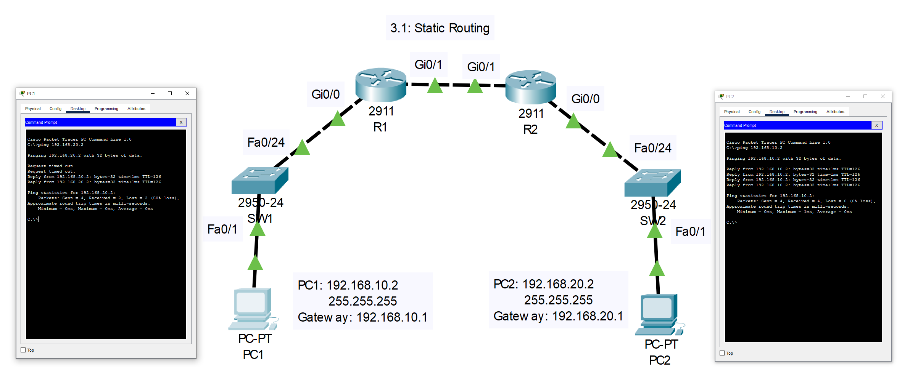
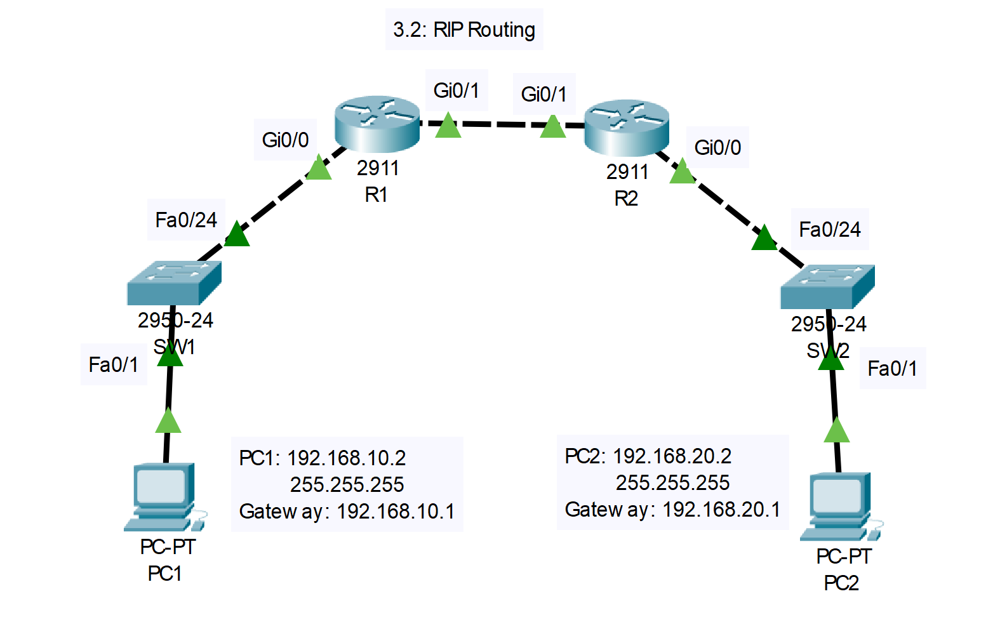
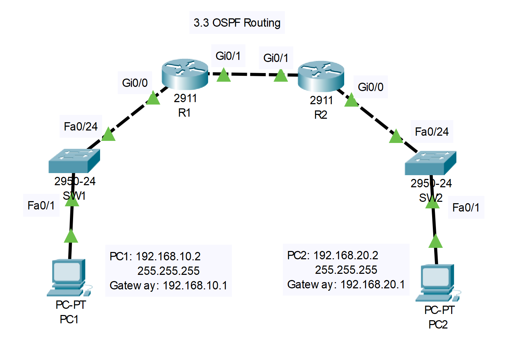

# ใบงานการตั้งค่าเครือข่ายใน Cisco Packet Tracer (v.8.2.2)


## 3. IP Routing (3 ใบงาน)

### ใบงาน 3.1: Static Routing
**วัตถุประสงค์**: ตั้งค่า Static Routing ระหว่างสองเครือข่าย  
**อุปกรณ์ที่ใช้**:
- Router: Cisco 2911 (2 ตัว, R1, R2)
- Switch: Cisco 2960-24TT (2 ตัว, SW1, SW2)
- PC: 2 เครื่อง (PC1, PC2)

**การเชื่อมต่อสาย**:
- PC1 --(Straight-through)--> SW1 (Fa0/1)
- PC2 --(Straight-through)--> SW2 (Fa0/1)
- SW1 (Fa0/24) --(Cross-over)--> R1 (Gi0/0)
- SW2 (Fa0/24) --(Cross-over)--> R2 (Gi0/0)
- R1 (Gi0/1) --(Cross-over)--> R2 (Gi0/1)

### ภาพไดอะแกรม


**การกำหนด IP Address, Subnet, Gateway**:
- PC1: 192.168.10.2/24, Gateway: 192.168.10.1
- PC2: 192.168.20.2/24, Gateway: 192.168.20.1
- R1: Gi0/0 = 192.168.10.1/24, Gi0/1 = 172.16.1.1/30
- R2: Gi0/0 = 192.168.20.1/24, Gi0/1 = 172.16.1.2/30

**การกำหนดชื่อและการตั้งค่า**:
- **R1**:
```plaintext
Router>enable
Router#configure terminal
Router(config)#hostname R1
R1(config)#interface gi0/0
R1(config-if)#ip address 192.168.10.1 255.255.255.0
R1(config-if)#no shutdown
R1(config-if)#exit
R1(config)#interface gi0/1
R1(config-if)#ip address 172.16.1.1 255.255.255.252
R1(config-if)#no shutdown
R1(config-if)#exit
R1(config)#ip route 192.168.20.0 255.255.255.0 172.16.1.2
R1(config)#exit
R1#wr
```
- **R2**:
```plaintext
Router>enable
Router#configure terminal
Router(config)#hostname R2
R2(config)#interface gi0/0
R2(config-if)#ip address 192.168.20.1 255.255.255.0
R2(config-if)#no shutdown
R2(config-if)#exit
R2(config)#interface gi0/1
R2(config-if)#ip address 172.16.1.2 255.255.255.252
R2(config-if)#no shutdown
R2(config-if)#exit
R2(config)#ip route 192.168.10.0 255.255.255.0 172.16.1.1
R2(config)#exit
R2#wr
```
- **SW1**:
```plaintext
Switch>enable
Switch#configure terminal
Switch(config)#hostname SW1
SW1(config)#interface fa0/1
SW1(config-if)#switchport mode access
SW1(config-if)#switchport access vlan 1
SW1(config-if)#exit
SW1(config)#interface fa0/24
SW1(config-if)#switchport mode access
SW1(config-if)#switchport access vlan 1
SW1(config-if)#exit
SW1(config)#exit
SW1#wr
```
- **SW2**:
```plaintext
Switch>enable
Switch#configure terminal
Switch(config)#hostname SW2
SW2(config)#interface fa0/1
SW2(config-if)#switchport mode access
SW2(config-if)#switchport access vlan 1
SW2(config-if)#exit
SW2(config)#interface fa0/24
SW2(config-if)#switchport mode access
SW2(config-if)#switchport access vlan 1
SW2(config-if)#exit
SW2(config)#exit
SW2#wr
```

**การทดสอบการทำงาน**:
- ใช้คำสั่ง `show ip route` บน R1 และ R2 เพื่อยืนยัน Static Route
- จาก PC1 ping PC2 (192.168.20.2, ควรสำเร็จ)
- จาก PC2 ping PC1 (192.168.10.2, ควรสำเร็จ)

**ภาพการเชื่อมต่อ (Text)**:
```
[PC1] -- [SW1 (Fa0/1)] -- [Fa0/24] -- [R1 (Gi0/0)]
                                        [R1 (Gi0/1)] -- [R2 (Gi0/1)]
[PC2] -- [SW2 (Fa0/1)] -- [Fa0/24] -- [R2 (Gi0/0)]
```

### สรุป 3.1 หน้าที่ของอุปกรณ์แต่ละชิ้น

* **PC1 (192.168.10.2)** และ **PC2 (192.168.20.2)**: เป็นคอมพิวเตอร์ 2 เครื่องที่อยู่คนละวงแลนกัน (คนละเครือข่าย) และเราต้องการทำให้มัน Ping หากันเจอ

* **SW1** และ **SW2**: เป็นสวิตช์ (Switch) ทำหน้าที่เหมือนปลั๊กพ่วงในแต่ละเครือข่าย ช่วยเชื่อมต่ออุปกรณ์ที่อยู่ในวงแลนเดียวกัน ในที่นี้คือเชื่อม PC1 เข้ากับ R1 และ PC2 เข้ากับ R2

* **R1** และ **R2**: เป็นเราเตอร์ (Router) พระเอกของงานนี้ ทำหน้าที่เป็น **"ประตู" (Gateway)** ของแต่ละเครือข่าย และเชื่อมต่อระหว่างเครือข่ายที่แตกต่างกัน

**ปัญหาคืออะไร?** 

ตามปกติแล้ว R1 จะรู้จักแค่เครือข่ายที่มันต่ออยู่โดยตรงเท่านั้น คือ

1. เครือข่ายของ PC1 (`192.168.10.0/24`) ที่ต่อกับขา `Gi0/0`

2. เครือข่ายที่เชื่อมระหว่าง R1 กับ R2 (`172.16.1.0/30`) ที่ต่อกับขา `Gi0/1`

**R1 ไม่รู้จักเครือข่ายของ PC2 (`192.168.20.0/24`) ** ในทางกลับกัน R2 ก็ไม่รู้จักเครือข่ายของ PC1 เช่นกัน ดังนั้นถ้า PC1 จะส่งข้อมูลไปหา PC2 ข้อมูลจะไปติดอยู่ที่ R1 เพราะ R1 ไม่รู้ว่าจะส่งต่อไปที่ไหน

### หัวใจของ Lab: การตั้งค่า Static Routing

Static Routing คือ **การที่เราเข้าไปบอก Router ด้วยตัวเองแบบตรงๆ เลยว่า "ถ้าจะไปเครือข่าย X ต้องส่งข้อมูลออกไปทางไหน"**

ใน Lab นี้ เราได้ใช้คำสั่ง `ip route` เพื่อสร้างเส้นทางนี้ขึ้นมา

#### **การตั้งค่าที่ R1**


```
R1(config)# ip route 192.168.20.0 255.255.255.0 172.16.1.2
```

* **ความหมาย**: จะบอกกับ R1 ว่า "ถ้าเธอได้รับข้อมูลที่ต้องการจะส่งไปยังเครือข่าย `192.168.20.0` (เครือข่ายของ PC2)..."

* "...ให้เธอส่งข้อมูลนั้นต่อไปยัง IP `172.16.1.2`" (ซึ่งก็คือ IP ขา `Gi0/1` ของ R2 นั่นเอง)

#### **การตั้งค่าที่ R2**

```
R2(config)# ip route 192.168.10.0 255.255.255.0 172.16.1.1
```

* **ความหมาย**: ในทางกลับกัน ก็บอก R2 ว่า "ถ้าเธอได้รับข้อมูลที่ต้องการจะส่งกลับไปยังเครือข่าย `192.168.10.0` (เครือข่ายของ PC1)..."

* "...ให้เธอส่งข้อมูลนั้นต่อไปยัง IP `172.16.1.1`" (ซึ่งก็คือ IP ขา `Gi0/1` ของ R1)

เมื่อตั้งค่าแบบนี้เสร็จ Router ทั้งสองตัวก็จะรู้จักเส้นทางไปยังเครือข่ายของอีกฝั่ง ทำให้สามารถส่งข้อมูลข้ามเครือข่ายหากันได้

***

### ลำดับการทำงานเมื่อ PC1 Ping ไปยัง PC2

1. **PC1 ส่งข้อมูล**: PC1 (192.168.10.2) ต้องการส่ง Ping ไปยัง PC2 (192.168.20.2) มันเห็นว่า IP ปลายทางอยู่คนละเครือข่ายกับตัวเอง เลยส่งข้อมูลไปที่ประตูหรือ **Default Gateway** ของมัน ซึ่งก็คือ R1 (192.168.10.1)

2. **R1 ตัดสินใจ**: R1 ได้รับข้อมูล มันเปิดดู "ตารางเส้นทาง" (Routing Table) ของตัวเอง แล้วก็เจอที่เราตั้งค่าไว้ว่า "อ๋อ... จะไป `192.168.20.0` ต้องส่งต่อไปให้ `172.16.1.2`"

3. **R1 ส่งต่อ**: R1 จึงส่งข้อมูลนั้นออกทางขา `Gi0/1` วิ่งตรงไปยัง R2

4. **R2 รับข้อมูล**: R2 รับข้อมูลเข้ามาทางขา `Gi0/1` และเห็นว่าปลายทางคือ 192.168.20.2 ซึ่งอยู่ในเครือข่ายที่มันรู้จักและเชื่อมต่อโดยตรงกับขา `Gi0/0`

5. **R2 ส่งถึงปลายทาง**: R2 จึงส่งข้อมูลนั้นออกทางขา `Gi0/0` ผ่าน SW2 ไปยัง PC2 ได้สำเร็จ! 

การ Ping กลับจาก PC2 มายัง PC1 ก็จะใช้หลักการเดียวกัน แต่ใช้เส้นทางที่เราตั้งค่าไว้บน R2 

### การทดสอบการทำงาน

* `show ip route`: ใช้คำสั่งนี้บน R1 และ R2 เพื่อดูตารางเส้นทาง จะต้องเห็นบรรทัดที่มีตัว **'S'** นำหน้า ซึ่งหมายถึง Static Route ที่เราเพิ่งตั้งค่าไป

* `ping`: เป็นการทดสอบการเชื่อมต่อปลายทางถึงปลายทาง (End-to-End) ถ้า Ping สำเร็จ แสดงว่าการตั้งค่าทั้งหมดถูกต้องและอุปกรณ์ทุกชิ้นทำงานประสานกันได้สมบูรณ์

***สรุปง่ายๆ Lab นี้คือการสอนให้เราเตอร์รู้จักเส้นทางที่ไม่รู้จักด้วยการ "บอก" มันตรงๆ นั่นเอง***

---

### ใบงาน 3.2: RIP Routing
**วัตถุประสงค์**: ตั้งค่า RIP เพื่อให้สองเครือข่ายสื่อสารกัน  
**อุปกรณ์ที่ใช้**:
- Router: Cisco 2911 (2 ตัว, R1, R2)
- Switch: Cisco 2960-24TT (2 ตัว, SW1, SW2)
- PC: 2 เครื่อง (PC1, PC2)

**การเชื่อมต่อสาย**:
- PC1 --(Straight-through)--> SW1 (Fa0/1)
- PC2 --(Straight-through)--> SW2 (Fa0/1)
- SW1 (Fa0/24) --(Cross-over)--> R1 (Gi0/0)
- SW2 (Fa0/24) --(Cross-over)--> R2 (Gi0/0)
- R1 (Gi0/1) --(Cross-over)--> R2 (Gi0/1)

### ภาพไดอะแกรม


**การกำหนด IP Address, Subnet, Gateway**:
- PC1: 192.168.10.2/24, Gateway: 192.168.10.1
- PC2: 192.168.20.2/24, Gateway: 192.168.20.1
- R1: Gi0/0 = 192.168.10.1/24, Gi0/1 = 172.16.1.1/30
- R2: Gi0/0 = 192.168.20.1/24, Gi0/1 = 172.16.1.2/30

**การกำหนดชื่อและการตั้งค่า**:
- **R1**:
```plaintext
Router>enable
Router#configure terminal
Router(config)#hostname R1
R1(config)#interface gi0/0
R1(config-if)#ip address 192.168.10.1 255.255.255.0
R1(config-if)#no shutdown
R1(config-if)#exit
R1(config)#interface gi0/1
R1(config-if)#ip address 172.16.1.1 255.255.255.252
R1(config-if)#no shutdown
R1(config-if)#exit
R1(config)#router rip
R1(config-router)#version 2
R1(config-router)#network 192.168.10.0
R1(config-router)#network 172.16.1.0
R1(config-router)#exit
R1(config)#exit
R1#wr
```
- **R2**:
```plaintext
Router>enable
Router#configure terminal
Router(config)#hostname R2
R2(config)#interface gi0/0
R2(config-if)#ip address 192.168.20.1 255.255.255.0
R2(config-if)#no shutdown
R2(config-if)#exit
R2(config)#interface gi0/1
R2(config-if)#ip address 172.16.1.2 255.255.255.252
R2(config-if)#no shutdown
R2(config-if)#exit
R2(config)#router rip
R2(config-router)#version 2
R2(config-router)#network 192.168.20.0
R2(config-router)#network 172.16.1.0
R2(config-router)#exit
R2(config)#exit
R2#wr
```
- **SW1** , **SW2** , **PC1** และ **PC2** เหมือนกับใบงาน 3.1  

**การทดสอบการทำงาน**:
- ใช้คำสั่ง `show ip route` บน R1 และ R2 เพื่อยืนยัน RIP Route
- จาก PC1 ping PC2 (192.168.20.2, ควรสำเร็จ)
- จาก PC2 ping PC1 (192.168.10.2, ควรสำเร็จ)

**ภาพการเชื่อมต่อ (Text)**:
```
[PC1] -- [SW1 (Fa0/1)] -- [Fa0/24] -- [R1 (Gi0/0)]
                                        [R1 (Gi0/1)] -- [R2 (Gi0/1)]
[PC2] -- [SW2 (Fa0/1)] -- [Fa0/24] -- [R2 (Gi0/0)]
```

## สรุปการทำงานของแล็บ 3.2 (RIP Routing) 
หัวใจของแล็บนี้คือการใช้คำสั่ง router rip และ network แทนการใช้ ip route

การตั้งค่าที่ R1 และ R2

### บน R1
```
R1(config)# router rip
R1(config-router)# network 192.168.10.0
R1(config-router)# network 172.16.1.0
```
### บน R2
```
R2(config)# router rip
R2(config-router)# network 192.168.20.0
R2(config-router)# network 172.16.1.0
```
ความหมาย: แทนที่เราจะบอกเส้นทางให้เราเตอร์ทีละเส้นทางเหมือนแล็บที่แล้ว (Static Routing) แล็บนี้เราจะใช้วิธีที่ฉลาดขึ้น
เราแค่สั่งให้เราเตอร์ "ประกาศ" (Advertise) เครือข่ายที่มันรู้จักโดยตรงออกไป

R1 จะประกาศว่า "ฉันรู้จักเครือข่าย 192.168.10.0 กับ 172.16.1.0 นะ!"
R2 ก็จะประกาศว่า "ฉันรู้จักเครือข่าย 192.168.20.0 กับ 172.16.1.0 นะ!"

การแลกเปลี่ยนข้อมูล: เมื่อ R1 และ R2 ได้รับประกาศของกันและกันผ่านทางเครือข่าย 172.16.1.0 ที่เชื่อมต่อถึงกัน พวกมันก็จะเรียนรู้เส้นทางใหม่ๆ ได้เองโดยอัตโนมัติ

R1 จะเรียนรู้ว่า "อ๋อ... ถ้าจะไปเครือข่าย 192.168.20.0 ต้องส่งไปหา R2"
R2 ก็จะเรียนรู้ว่า "ถ้าจะไปเครือข่าย 192.168.10.0 ต้องส่งไปหา R1"

ผลลัพธ์สุดท้ายเหมือนกันคือ PC1 สามารถ Ping ไปยัง PC2 ได้สำเร็จ แต่กระบวนการเบื้องหลังแตกต่างกันโดยสิ้นเชิง

สรุปง่ายๆ คือ
Static Routing (แล็บ 3.1) เหมือนการ "บอกทางแบบเจาะจง" ทีละขั้นตอน
RIP (แล็บ 3.2) เหมือนการที่แต่ละแยก (เราเตอร์) "ตะโกนบอกทางที่ตัวเองรู้จัก" แล้วแยกอื่นๆ ก็ฟังและเรียนรู้เส้นทางกันเอง

---

### ใบงาน 3.3: OSPF Routing
**วัตถุประสงค์**: ตั้งค่า OSPF เพื่อให้สองเครือข่ายสื่อสารกัน  
**อุปกรณ์ที่ใช้**:
- Router: Cisco 2911 (2 ตัว, R1, R2)
- Switch: Cisco 2960-24TT (2 ตัว, SW1, SW2)
- PC: 2 เครื่อง (PC1, PC2)

**การเชื่อมต่อสาย**:
- เหมือนกับใบงาน 3.1 ,3.2

  ### ภาพไดอะแกรม


**การกำหนด IP Address, Subnet, Gateway**:
- เหมือนกับใบงาน 3.2

**การกำหนดชื่อและการตั้งค่า**:
- **R1**:
```plaintext
Router>enable
Router#configure terminal
Router(config)#hostname R1
R1(config)#interface gi0/0
R1(config-if)#ip address 192.168.10.1 255.255.255.0
R1(config-if)#no shutdown
R1(config-if)#exit
R1(config)#interface gi0/1
R1(config-if)#ip address 172.16.1.1 255.255.255.252
R1(config-if)#no shutdown
R1(config-if)#exit
R1(config)#router ospf 1
R1(config-router)#network 192.168.10.0 0.0.0.255 area 0
R1(config-router)#network 172.16.1.0 0.0.0.3 area 0
R1(config-router)#exit
R1(config)#exit
R1#wr
```
- **R2**:
```plaintext
Router>enable
Router#configure terminal
Router(config)#hostname R2
R2(config)#interface gi0/0
R2(config-if)#ip address 192.168.20.1 255.255.255.0
R2(config-if)#no shutdown
R2(config-if)#exit
R2(config)#interface gi0/1
R2(config-if)#ip address 172.16.1.2 255.255.255.252
R2(config-if)#no shutdown
R2(config-if)#exit
R2(config)#router ospf 1
R2(config-router)#network 192.168.20.0 0.0.0.255 area 0
R2(config-router)#network 172.16.1.0 0.0.0.3 area 0
R2(config-router)#exit
R2(config)#exit
R2#wr
```
- **SW1** , **SW2** , **PC1** และ **PC2** เหมือนกับใบงาน 3.1  

**การทดสอบการทำงาน**:
- ใช้คำสั่ง `show ip ospf neighbor` เพื่อยืนยันว่า R1 และ R2 เป็น Neighbor
- ใช้คำสั่ง `show ip route` เพื่อยืนยัน OSPF Route
- จาก PC1 ping PC2 (192.168.20.2, ควรสำเร็จ)

**ภาพการเชื่อมต่อ (Text)**:
```
[PC1] -- [SW1 (Fa0/1)] -- [Fa0/24] -- [R1 (Gi0/0)]
                                        [R1 (Gi0/1)] -- [R2 (Gi0/1)]
[PC2] -- [SW2 (Fa0/1)] -- [Fa0/24] -- [R2 (Gi0/0)]
```

### สรุปการทำงานของแล็บ 3.3 (OSPF Routing)

สำหรับแล็บนี้ เรายังคงมีเป้าหมายเดิมคือทำให้ PC ทั้งสองฝั่งคุยกันได้ โดยใช้อุปกรณ์และ IP Address ชุดเดิมทั้งหมด แต่เราได้เปลี่ยนวิธีการบอกเส้นทางมาเป็น **OSPF (Open Shortest Path First)** ซึ่งเป็น Dynamic Routing Protocol ที่ฉลาดและมีประสิทธิภาพสูงกว่า RIP 

หัวใจของการตั้งค่าในแล็บนี้คือคำสั่ง:

```Bash
# บน R1
R1(config)# router ospf 1
R1(config-router)# network 192.168.10.0 0.0.0.255 area 0
R1(config-router)# network 172.16.1.0 0.0.0.3 area 0
```

* **`router ospf 1`**: เป็นการเริ่มกระบวนการ OSPF  (เลข `1` คือ Process ID ที่เราตั้งขึ้นมาเอง)
* **`network ... area 0`**: คำสั่งนี้จะทำ 2 อย่างคือ:

  1. **ประกาศ (Advertise)**: บอกให้เราเตอร์เพื่อนบ้านรู้ว่า "ฉันรู้จักเครือข่ายนี้นะ"
  2. **ค้นหาเพื่อนบ้าน (Neighbor)**: เปิดใช้งาน OSPF บน Interface ที่มี IP อยู่ในขอบเขตของ network ที่ระบุ เพื่อค้นหาเราเตอร์ OSPF ตัวอื่น

* **`0.0.0.255`**: สิ่งนี้เรียกว่า **Wildcard Mask**  มันคือส่วนกลับของ Subnet Mask (ในที่นี้คือกลับด้านมาจาก 255.255.255.0) เพื่อใช้บอกขอบเขตของเน็ตเวิร์ค
* **`area 0`**: เป็นการกำหนดให้เครือข่ายนี้อยู่ใน "Area" หลักของ OSPF ที่เรียกว่า Backbone Area

**การทำงานของ OSPF:** แทนที่จะแลกเปลี่ยน "ตารางเส้นทาง" ทั้งหมดเหมือน RIP, เราเตอร์ OSPF จะสร้าง **"เพื่อนบ้าน" (Neighbor)** กันก่อน จากนั้นจะแลกเปลี่ยนข้อมูล **"สถานะของลิงก์" (Link-State)** ทั้งหมด เพื่อให้เราเตอร์แต่ละตัวสร้าง **"แผนที่" (Map)** ของเครือข่ายทั้งหมดขึ้นมาเอง แล้วใช้อัลกอริทึม SPF (Shortest Path First) คำนวณหาเส้นทางที่ดีที่สุด ซึ่งโดยปกติจะพิจารณาจาก **ค่า Cost** (ที่คำนวณจาก Bandwidth ของลิงก์) ทำให้ฉลาดกว่า RIP ที่นับแค่จำนวน Hop (จำนวนเราเตอร์ที่ต้องผ่าน)

---