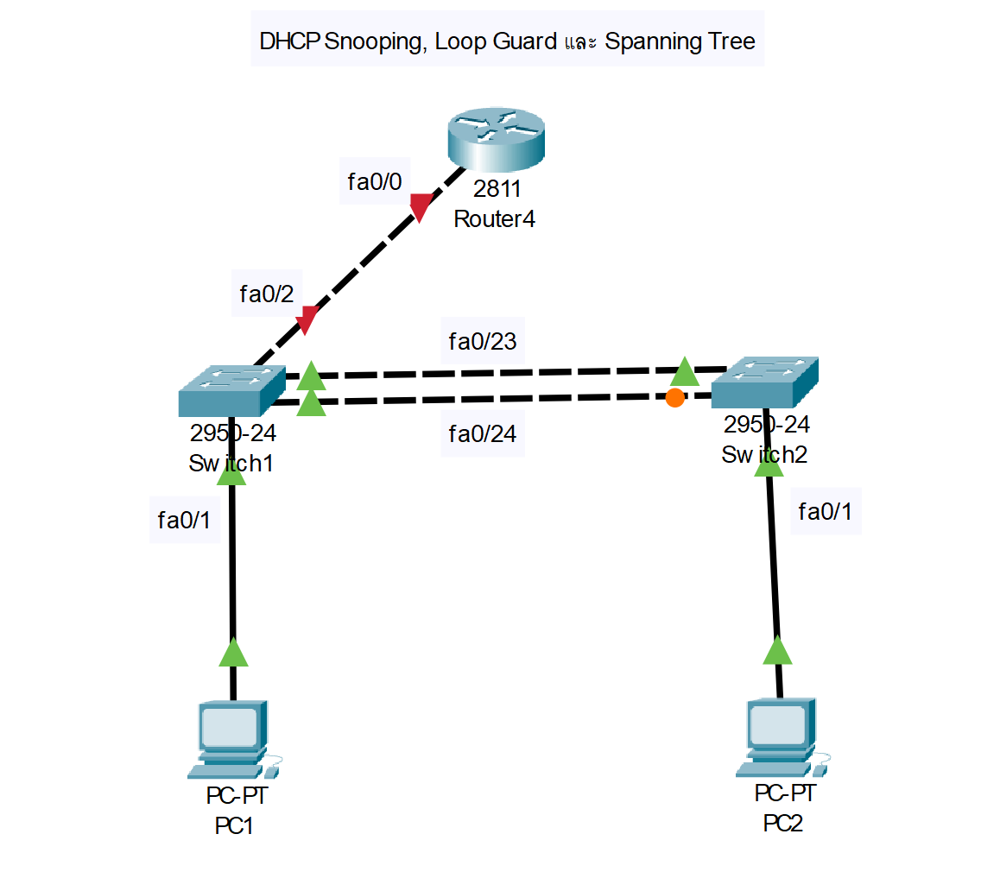

### หน่วยที่ 3: DHCP Snooping, Loop Guard และ Spanning Tree
**หัวข้อ:**
- การป้องกันการโจมตี DHCP ด้วย DHCP Snooping
- การป้องกัน Loop ด้วย Loop Guard และ Spanning Tree Protocol (STP)
- การตรวจสอบสถานะ STP

**ตัวอย่างแล็บ: การตั้งค่า DHCP Snooping และ STP**

#### อุปกรณ์ที่ใช้
- Router: Cisco 2811 (1 ตัว)
- Switch: Cisco 2950-24 (2 ตัว)
- PC: 2 เครื่อง
- สาย: สาย Straight-through และ Cross-over

#### การเชื่อมต่อสาย
```
PC1 --(Straight-through)--> Switch1 (Fa0/1)
PC2 --(Straight-through)--> Switch2 (Fa0/1)
Switch1 (Fa0/24) --(Cross-over)--> Switch2 (Fa0/24)
Switch1 (Fa0/23) --(Cross-over)--> Switch2 (Fa0/23)
Switch1 (Fa0/2) --(Cross-over)--> Router (Fa0/0)
```
#### ภาพไดอะแกรม


#### การกำหนด IP Address, Subnet, Gateway
- PC1-PC2: รับ IP จาก DHCP
- Router: Fa0/0 = 192.168.10.1, Subnet = 255.255.255.0

#### การกำหนดชื่อและการตั้งค่า
**Router**
```text
Router>enable
Router#configure terminal
Router(config)#hostname R1
R1(config)#interface fa0/0
R1(config-if)#ip address 192.168.10.1 255.255.255.0
R1(config-if)#no shutdown
R1(config-if)#exit
R1(config)#ip dhcp pool LAN
R1(config-dhcp)#network 192.168.10.0 255.255.255.0
R1(config-dhcp)#default-router 192.168.10.1
R1(config-dhcp)#exit
R1(config)#wr
```
**Switch1**
```text
Switch>enable
Switch#configure terminal
Switch(config)#hostname SW1
SW1(config)#ip dhcp snooping
SW1(config)#ip dhcp snooping vlan 10
SW1(config)#interface fa0/2
SW1(config-if)#ip dhcp snooping trust
SW1(config-if)#exit
SW1(config)#spanning-tree mode rapid
SW1(config)#spanning-tree loopguard default
SW1(config)#interface range fa0/23 - 24
SW1(config-if-range)#switchport mode trunk
SW1(config-if-range)#exit
SW1(config)#wr
```
**Switch2**
```text
Switch>enable
Switch#configure terminal
Switch(config)#hostname SW2
SW2(config)#ip dhcp snooping
SW2(config)#ip dhcp snooping vlan 10
SW2(config)#spanning-tree mode rapid
SW2(config)#spanning-tree loopguard default
SW2(config)#interface range fa0/23 - 24
SW2(config-if-range)#switchport mode trunk
SW2(config-if-range)#exit
SW2(config)#wr
```

#### การทดสอบการทำงาน
- ตรวจสอบ DHCP Snooping ด้วย `show ip dhcp snooping`
- ตรวจสอบสถานะ STP ด้วย `show spanning-tree`
- ใช้ `ping` จาก PC1 ไป PC2 เพื่อยืนยันการเชื่อมต่อ

#### ภาพการเชื่อมต่อ (Text)
```
[PC1] -- [SW1 (Fa0/1)] -- [Fa0/24 (Trunk)] -- [SW2 (Fa0/24)] -- [PC2]
           |                                  |
           +----[Fa0/23 (Trunk)]----[Fa0/23]--+
           |
         [Fa0/2] -- [R1 (Fa0/0)]
```
# อธิบายการทำงาน
### **1. การป้องกันการโจมตี DHCP ด้วย DHCP Snooping**

**DHCP Snooping** เป็นกลไกที่ช่วยป้องกันการโจมตีจาก DHCP Server ปลอม (Rogue DHCP Server) โดยการกรองแพ็กเก็ต DHCP ที่ไม่น่าเชื่อถือ

* **หลักการทำงาน**

  * สวิตช์จะแบ่งพอร์ตเป็น **Trusted** (เชื่อถือได้) และ **Untrusted** (ไม่เชื่อถือได้)
  * พอร์ต **Trusted** เช่น พอร์ตที่เชื่อมต่อกับ DHCP Server หรือ Router จะอนุญาตให้ส่งแพ็กเก็ต DHCP Offer และ Acknowledgment ได้
  * พอร์ต **Untrusted** เช่น พอร์ตที่เชื่อมต่อกับ PC จะกรองแพ็กเก็ต DHCP Offer และ Acknowledgment เพื่อป้องกัน Rogue DHCP Server
  * สวิตช์จะสร้าง **DHCP Snooping Binding Table** เพื่อเก็บข้อมูล เช่น IP Address, MAC Address, VLAN และพอร์ตของอุปกรณ์ที่ได้รับ IP จาก DHCP

### **2. การป้องกัน Loop ด้วย Loop Guard และ Spanning Tree Protocol (STP)**

**STP** และ **Loop Guard** ช่วยป้องกัน **Broadcast Storm** ที่เกิดจาก Loop ในเครือข่ายสวิตช์

* **Spanning Tree Protocol (STP)**

  * **หลักการทำงาน**

    * STP ป้องกัน Loop โดยการเลือกพอร์ตที่เหมาะสมให้อยู่ในสถานะ **Forwarding** และบล็อกพอร์ตที่อาจก่อให้เกิด Loop (สถานะ **Blocking**)
    * ใช้ **Bridge Protocol Data Units (BPDUs)** ในการสื่อสารระหว่างสวิตช์เพื่อกำหนด **Root Bridge** และโครงสร้างต้นไม้ที่ปราศจาก Loop
    * ในตัวอย่างนี้ใช้ **Rapid Per-VLAN Spanning Tree (PVST)** ซึ่งเร็วกว่า STP แบบดั้งเดิม

  * **การตั้งค่า**
```text
spanning-tree mode rapid
```
* เปิดใช้งาน Rapid STP บน **SW1** และ **SW2** เพื่อลดเวลาการ Converge (การปรับโครงสร้างเมื่อเกิดการเปลี่ยนแปลงในเครือข่าย)

* **Loop Guard**

  * **หลักการทำงาน**

    * ป้องกันปัญหาที่เกิดจาก **Unidirectional Link** หรือการที่สวิตช์ไม่ได้รับ BPDU จากสวิตช์คู่ตรงข้าม
    * เมื่อพอร์ตไม่ได้รับ BPDU ตามที่คาดไว้ Loop Guard จะเปลี่ยนพอร์ตนั้นเป็นสถานะ **Loop-Inconsistent** เพื่อป้องกัน Loop

  * **การตั้งค่า**
```text
spanning-tree loopguard default
```

* เปิดใช้งาน Loop Guard บนทุกพอร์ตของ **SW1** และ **SW2**

* **การเชื่อมต่อในตัวอย่าง**

  * มีการเชื่อมต่อแบบ Redundant ระหว่าง **SW1** และ **SW2** ผ่านพอร์ต **Fa0/23** และ **Fa0/24** (Trunk)
  * STP จะเลือกพอร์ตใดพอร์ตหนึ่งให้อยู่ในสถานะ Blocking เพื่อป้องกัน Loop
  * Loop Guard ช่วยป้องกันกรณีที่ BPDU หายไป เช่น เนื่องจากปัญหาสายหรือการตั้งค่าผิดพลาด

* **ผลลัพธ์**

  * เครือข่ายจะไม่มี Loop และสามารถ Converge ได้อย่างรวดเร็วเมื่อเกิดการเปลี่ยนแปลง

  * ตรวจสอบได้ด้วยคำสั่ง

```text
show spanning-tree
```
### **3. การตรวจสอบสถานะ STP**

* คำสั่ง **show spanning-tree** จะแสดงข้อมูล เช่น

  * **Root Bridge**: สวิตช์ใดเป็น Root Bridge (ขึ้นอยู่กับ Bridge ID ซึ่งประกอบด้วย Priority และ MAC Address)
  * **Port Status**: สถานะของแต่ละพอร์ต (Forwarding, Blocking, Listening, Learning)
  * **VLAN Information**: ข้อมูล STP สำหรับแต่ละ VLAN (ในกรณีนี้คือ VLAN 10)
